# Boops & Snoots Rescue

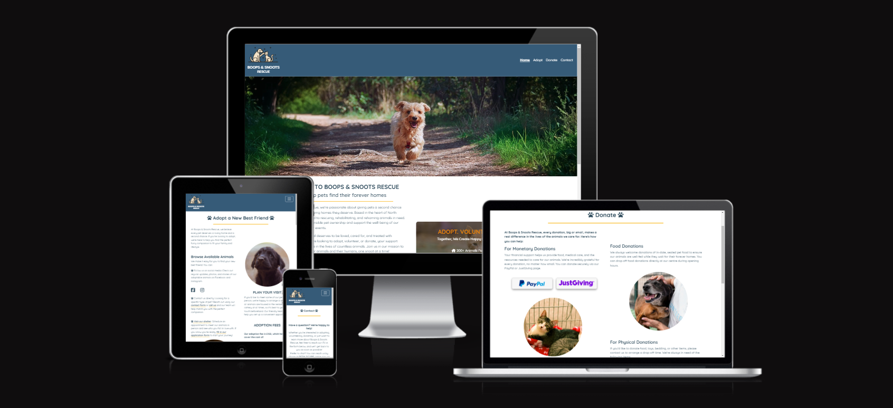

#### About:

Boops & Snoots Rescue is a fictional animal adoption organisation based in North Wales. This static front-end website is designed to raise awareness of the organisation, encourage pet adoptions, and provide clear ways to donate and support the cause. The website focuses on a user-friendly experience that emphasizes the organisation’s strong brand identity, ensuring that visitors feel welcomed and informed.

[View Live Site.](https://seren-hughes.github.io/boops-and-snoots-rescue/) Hosted on GitHub Pages.

#### Design & Brand Identity

Boops & Snoots Rescue aims for a friendly and approachable feel, using vibrant colours and playful typography to reflect the joyful nature of animal adoption. The site’s branding emphasises the theme that "pets are family members," with a tone that’s warm and supportive. By using images of happy animals, the site aims to highlight the positive impact of adoption and create an emotional connection with visitors.

#### Key Features

- **Home Page:** Information about Boops & Snoots Rescue, its mission, and core values.
- **Adopt Page:** Information on the adoption process, adoption fees, and reasons to adopt a pet, as well as an application form to start the adoption process.
- **Donate Page:** Clear donation options, including links to PayPal, Just Giving and instructions for donating food, bedding, and toys to the rescue.
- **Contact Page:** A contact form and fictional contact details (address, phone number and shelter opening hours)

## Table Of Contents:

1. [Design & Planning](#design--planning)
   - [Objectives](#objectives)
   - [User Stories](#user-stories)
   - [Wireframes](#wireframes)
   - [Typography](#typography)
   - [Colour Scheme](#colour-scheme)
2. [Features](#features)

   - [Navigation](#navigation---customised-boostrap-navbar)
   - [Footer](#footer---customised-bootstrap-layout-with-interactive-links)
   - [Other features](#other-features)

3. [Technologies Used](#technologies-used)
4. [Testing](#testing)
5. [Deployment](#deployment)
6. [Stretch Goals](#stretch-goals)
7. [Future Enhancements](#future-enhancements)
8. [Credits](#credits)

## Design & Planning:

### Objectives

#### Main Objective:

- Create an engaging, user-friendly platform that inspires adoptions and encourages donations.

#### Supporting Objectives:

- Increase awareness of the Boops & Snoots Rescue organisation and brand identity.
- Highlight the organisation’s mission to foster trust and connection.
- Showcase the organisation’s positive impact to encourage trust and support for adoptions and donations.
- Provide assurance that all animals available for adoption have been thoroughly assessed for health and behaviour, ensuring they are ready for their new homes—especially important for families with children.
- Provide clear ways for users to contact the organisation, including location, phone number, social media links, and an enquiry form.
- Maintain a positive, welcoming tone to build enthusiasm and support for the organisation.

####

## User Stories

#### Home Page:

- "As someone visiting the website, I want to easily understand what the organisation is about, find information about available animals, learn about the adoption process (including fees) how to get involved or donate, and quickly access contact details, location, and opening hours so I can plan my visit or make enquiries."

#### Contact:

- "As a visitor to the website, I want to easily find contact information so that I can quickly get in touch with the organisation for general enquiries."
- "As someone wanting to ask a question, I want a simple inquiry form so I can send a message without needing to email directly."
- "As a potential visitor, I want to know the organisation’s location, phone number, and opening hours so I can plan my visit."
- "As a social media user, I want links to the organisation’s social accounts so I can follow updates and message them through my preferred platform."
- "As a user visiting the website, I want a disclaimer that explains the website is fictional so I understand its purpose and context."

#### Donations:

- "As a pet owner, I want to donate items like unused pet food to help the shelter and avoid waste."
- "As a visitor to the site, I want to know what items the shelter needs so I can contribute effectively."
- "As someone who wants to support the organisation financially, I want clear information on how to donate money, so I can contribute easily and confidently."

#### Adoptions:

- "As someone looking to adopt, I want to find out how I can find a pet, understand the adoption process (including costs and requirements), and easily find contact information to speak to someone about adoptions or ask questions."
- "As someone adopting a pet, I want to know where the shelter is located and its opening hours so I can plan my visit."
- "As someone adopting a pet, I want to feel confident that the animal I adopt has been assessed for health and behaviour, ensuring it is ready for a safe and happy transition into my home—especially if I have children."
- "As someone looking to adopt or foster an animal, I want an online application form so that I can easily provide my details and speed up the process of being matched with a suitable pet."

## Wireframes

In designing the layout for the Boops & Snoots Rescue website, I followed a mobile-first approach, ensuring the site is fully responsive across different device sizes. This method prioritises mobile design to provide a seamless user experience on smartphones, before adapting for tablet and desktop views. The wireframes were created using [Balsamiq](https://balsamiq.com/), and below are the visual representations of the site’s structure and key elements across mobile, tablet, and desktop formats.

1. ### Index / Home Page:

     

<em>Click to expand wireframes</em>

   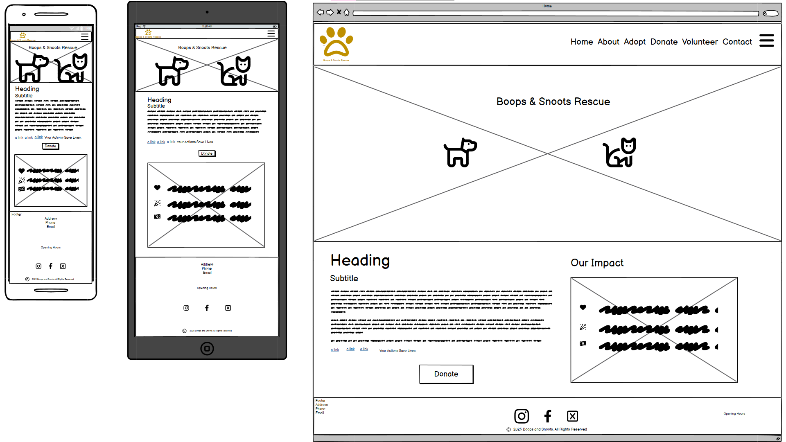

     

2. ### Adopt Page:

     

<em>Click to expand wireframes</em>

   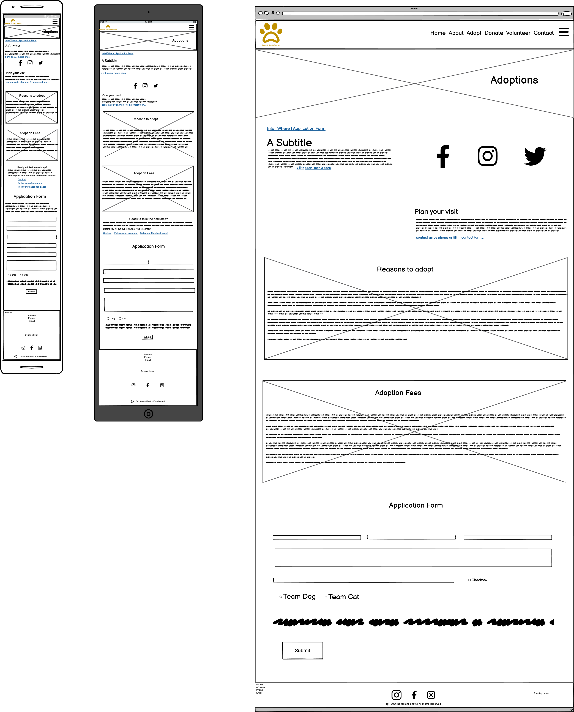

     

3. ### Donate Page:

     

<em>Click to expand wireframes</em>

   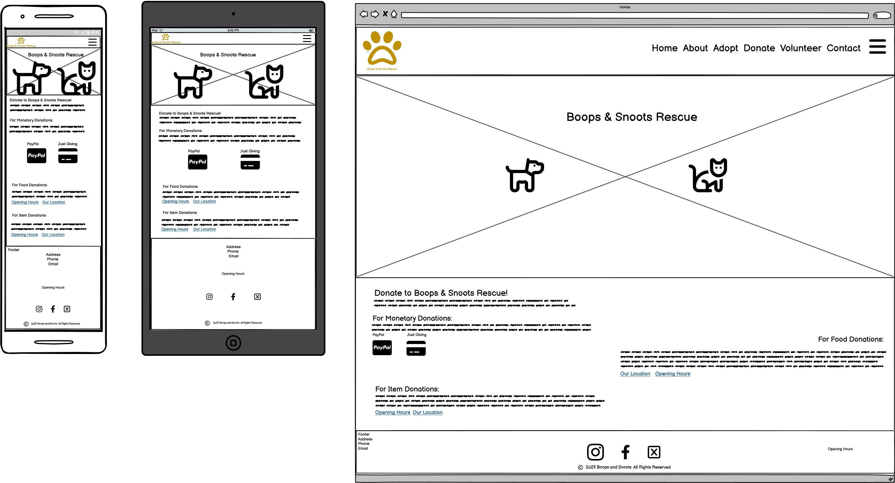

     

4. ### Contact Page:

     

<em>Click to expand wireframes</em>

   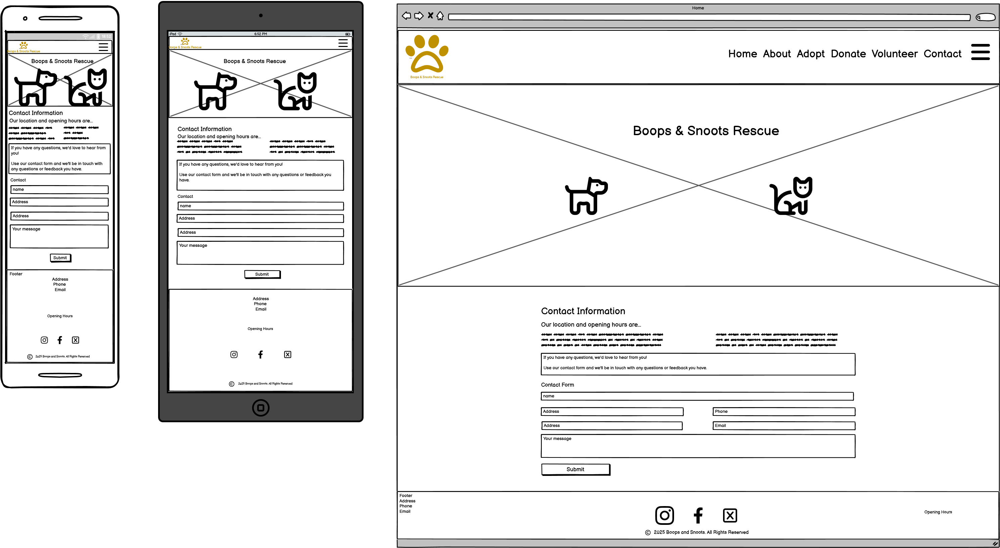

     

5. ### Form Submission Success Page:

     

<em>Click to expand wireframes</em>

   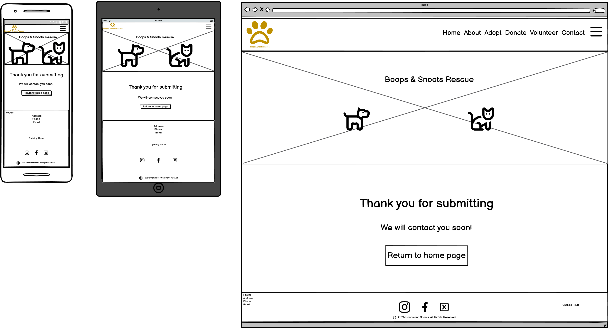

     

6. ### 404 Error Page:

     

<em>Click to expand wireframes</em>

   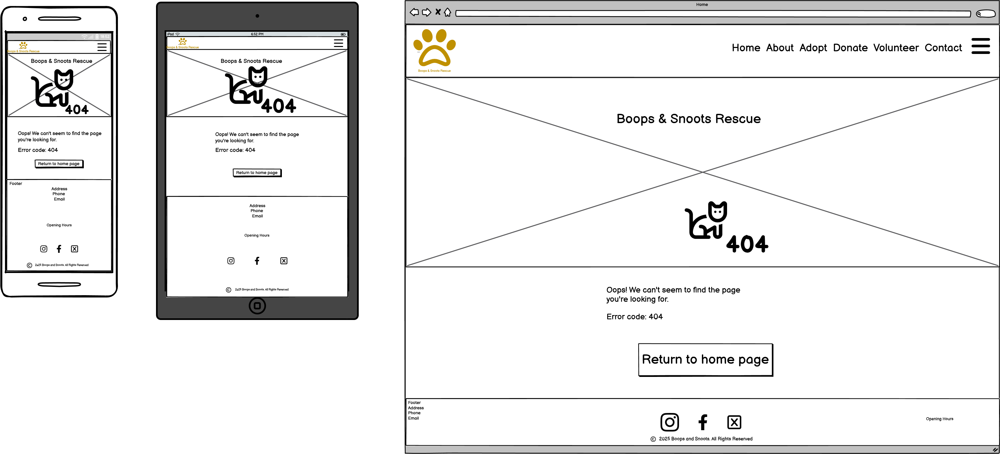

     

## Typography

For this project, Google Fonts was used to create a cohesive and accessible typography style:

- **Quicksand:** Used for the majority of the site’s content, including headings and body text. This font has a rounded, modern design that brings a fun, approachable, and positive vibe to the site, reflecting the welcoming nature of Boops & Snoots Rescue. It balances personality with professionalism, ensuring the site feels inviting yet trustworthy.
- **Lato:** Chosen for form inputs and areas where a more formal tone was needed. Lato is a clean, sans-serif font with excellent legibility, making it ideal for areas requiring a professional feel, such as forms and informational sections. It pairs seamlessly with Quicksand, ensuring a cohesive and accessible design.
  Both fonts were selected to ensure a balance between a friendly, approachable feel and professionalism, enhancing the overall user experience across the site.

## Colour Scheme

The website’s colour scheme was carefully selected using [Coolors](https://coolors.co/) to create a welcoming, engaging, and user-friendly experience. A combination of calm blues, warm highlights, and a clean neutral background aligns with _Boops & Snoots Rescue’s_ branding, reinforcing trust, positivity, and approachability.

- **Primary Colour – Dark Blue (#2D4A5B):** Used for text and headings, this deep blue conveys trust and stability.
- **Secondary Colour – Light Blue (#365B78):** Featured in the navigation bar and logo, ensuring brand consistency.
- **Primary Highlight – Orange (#E4810B):** A bold, warm and energetic colour used for call-to-action elements, drawing attention and encouraging interaction.
- **Secondary Highlight – Yellow (#FBC037):** A cheerful, uplifting colour used for hover effects and subtle separators.
- **Accent Colour – Light Yellow (#FFD978):** Enhances decorative elements, softening the design while keeping it cheerful.
- **Neutral Background – Light Grey (#F1EFE8A5):** Applied to the application and contact forms, ensuring readability while maintaining a light, friendly feel.

Additionally, white space (#FFFFFF) plays a key role in the design, keeping the interface clean, modern, and easy to navigate. The balance of blues, warm tones, and neutral shades creates a professional yet friendly aesthetic that reflects the mission of Boops & Snoots Rescue.

### Accessibility Considerations

Ensuring strong colour contrast for readability was a key design principle from the outset. Before development, the colour choices were tested using the [WebAIM Contrast Checker](https://webaim.org/resources/contrastchecker/) to confirm compliance with WCAG (Web Content Accessibility Guidelines). The goal was to maintain high contrast ratios for text elements, particularly for call-to-action buttons and important information, ensuring the site is accessible to users with visual impairments or colour blindness.

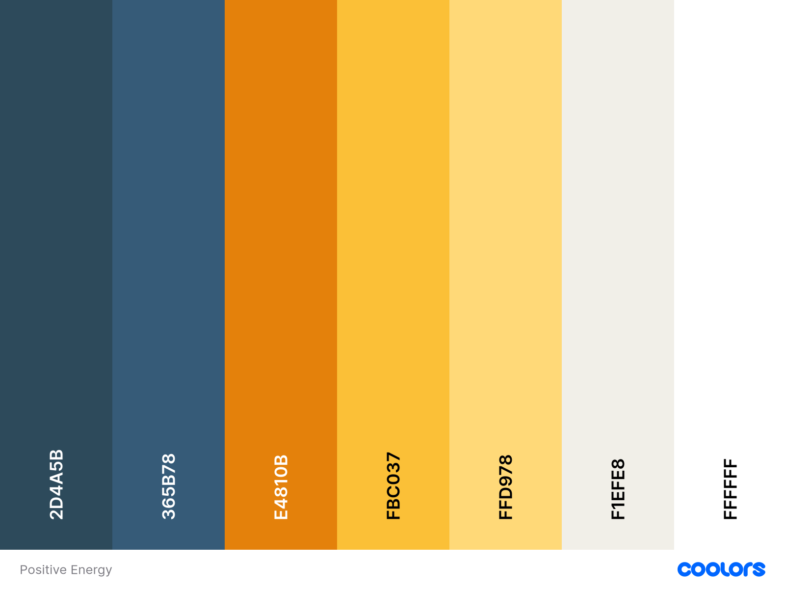

## Features:

- ### Homepage
  - Introduction to the organisation's mission, goals and brand
- ### Adoption Page
  - Overview of adoption processes, fees, links to social media for available animals and an application form
- ### Donation Page
  - Options for monetary and item donations
- ### Contact Us Page
  - Enquiry form with dropdown for enquiry type selection
- ### Success Page
  - A dummy Confirmation page for submitted forms. Since this is a static website with no backend functionality, the confirmation page is a placeholder to demonstrate the user experience after form submission.
- ### 404 Page
  - Custom 404 page with redirect button to homepage
    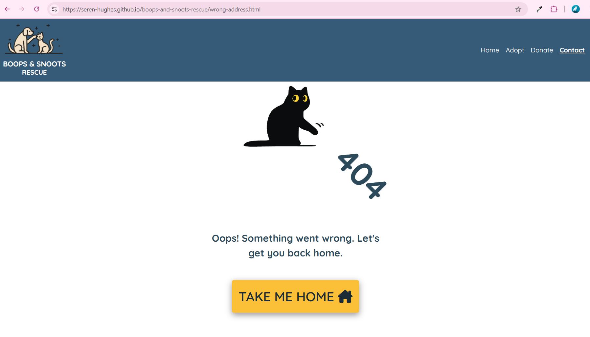

### Navigation - Customised Boostrap Navbar

For the navigation bar on the Boops & Snoots Rescue website, I’ve used Bootstrap's responsive navbar component, which I customised to suit the branding and style of the site. The navbar is fully responsive, automatically adjusting its layout for smaller screens, and includes a toggle feature that allows users to easily access the navigation links on mobile devices.

I’ve customised the navbar with my own brand logo and text, ensuring that it reflects the playful and friendly vibe of the website. This customisation maintains the overall structure provided by Bootstrap, while enhancing the user experience by aligning it with the branding.

In addition to the custom logo and text, I’ve applied a hover effect to the navbar links, which changes their colour when users hover over them. This small but effective touch adds an interactive element to the navigation, making it more engaging while ensuring that the links are easy to identify and access.

#### Key Features:

- Fully Responsive: The navbar adapts dynamically to different screen sizes, featuring a toggle menu for improved mobile usability.
- Custom Branding: Added a custom brand logo and text to match the site’s playful tone.
- Hover Effects on Links: Links have colour-changing hover effects, making them visually interactive and easy to navigate.
- These customisations enhance the user experience by offering a sleek, responsive navigation system that allows users to quickly access key pages while maintaining the site’s branding and playful style.

Below are screenshots showing the full navbar (for larger screens) and the small-screen toggle navbar (for mobile and tablet view), highlighting how the layout adjusts to ensure a seamless user experience across all devices.

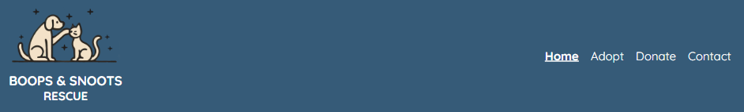

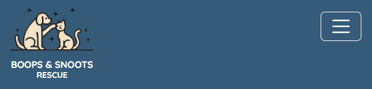

### Footer - Customised Bootstrap Layout with Interactive Links

For the footer on the Boops & Snoots Rescue website, I designed a layout utilizing Bootstrap's responsive container and grid system that adapts to both large and small screens. While the structure is based on Bootstrap, I’ve customised various elements to better align with the site’s branding and user experience. The footer contains essential information such as contact details, social media links, and a disclaimer, ensuring that users can easily access the information they need, regardless of the device they are using.

Key features include:

- **Interactive Contact Links:** The fictional address is linked to Google Maps, so clicking on it opens the map in a new tab (or in the app on mobile devices). The phone number is also linked, enabling users to open their default calling app, while the email address launches the default email client for easy communication.
- **Social Media Links:** Custom icons provide quick access to the rescue’s social media pages, allowing users to stay up to date with available pets and fundraising events.
- **Stylish Text Links:** To enhance visual appeal, I have added custom dashed-dot underline styles to text links, reinforcing the overall branding.
- **Hover Effects:** All links in the footer have a colour change hover effect, ensuring they are easily identifiable as interactive elements.
- **Override of Default Link Colours:** I have overridden the default blue hyperlinks to align with the website’s colour scheme and branding. This creates a consistent and cohesive look across all pages.
- **Opening Hours:** The footer includes fictional opening hours for the rescue centre, providing users with operational details at a glance.
- **Disclaimer:** At the bottom of the footer, I’ve added a disclaimer to clarify that the website is fictional and for educational or portfolio purposes only.

These features ensure that the footer provides essential information while remaining intuitive and user-friendly. Whether users are browsing on a desktop or mobile device, the footer remains accessible and functional.

Below are screenshots demonstrating the footer layout across different screen sizes:

<em>Click to expand large footer layout</em>

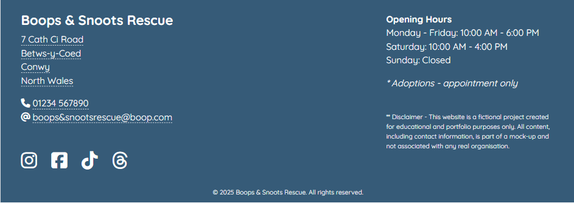

<em>Click to expand small footer layout</em>

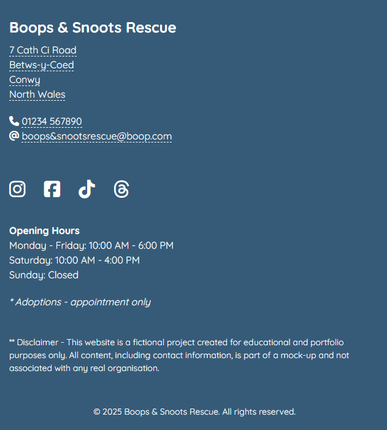

## Other features

### _"...Because Every Snoot Deserves a Boop"_ - Custom Pointer, Modal and Video for Donations

To add a playful touch to the site, I have included a subtle "Easter egg" feature: a snoot (nose) image linked to a donation modal, accompanied by the phrase "Because Every Snoot Deserves a Boop" with an arrow pointing downwards. This fun and interactive element is designed to engage users while drawing attention to the donation section. While the main donation button remains easily visible below, this feature adds an extra layer of personality and encourages interaction.

This is an intentional part of the branding, ensuring that users can explore interactive elements while maintaining a clear and accessible donation pathway. It also showcases the interactive modal and video functionality, enhancing the user experience.

#### Custom Pointer and Hover Effects

To highlight the nose image as an interactive element, I have implemented a custom pointer effect:

- **Custom Pointer:** When users hover over the nose image, the cursor changes to a finger pointer to resemble a "boop" action, inviting them to click.
- **Hover Effect:** The nose image scales up by 10% on hover, creating a dynamic effect that makes it feel more interactive and engaging.

#### Donation Modal with Video

When users click on the snoot image, a modal appears containing a short video of a cat enjoying a gentle snoot fuss, along with a clear call to action encouraging users to donate. The modal is designed to be user-friendly, providing an easy-to-access donation button that redirects users to the donation page.

Key features:

- **Custom Pointer Effect:** Reinforces interactivity by changing the cursor to a finger pointer.
- **Hover Scaling:** Increases the size of the snoot image slightly when hovered over.
- **Pop-up Modal:** Displays a heartwarming video of a cat’s snoot being fussed, paired with a message encouraging donations.
- **Clear Call to Action:** A direct donation button within the modal ensures easy navigation to the donation page.

These features allow users to engage with the site in a fun and meaningful way while maintaining control over their browsing experience. Users can play the video, close the modal, or proceed to the donation page at their own pace.

Below are screenshots demonstrating these features in action:

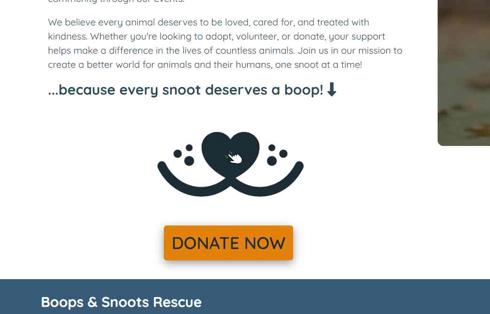

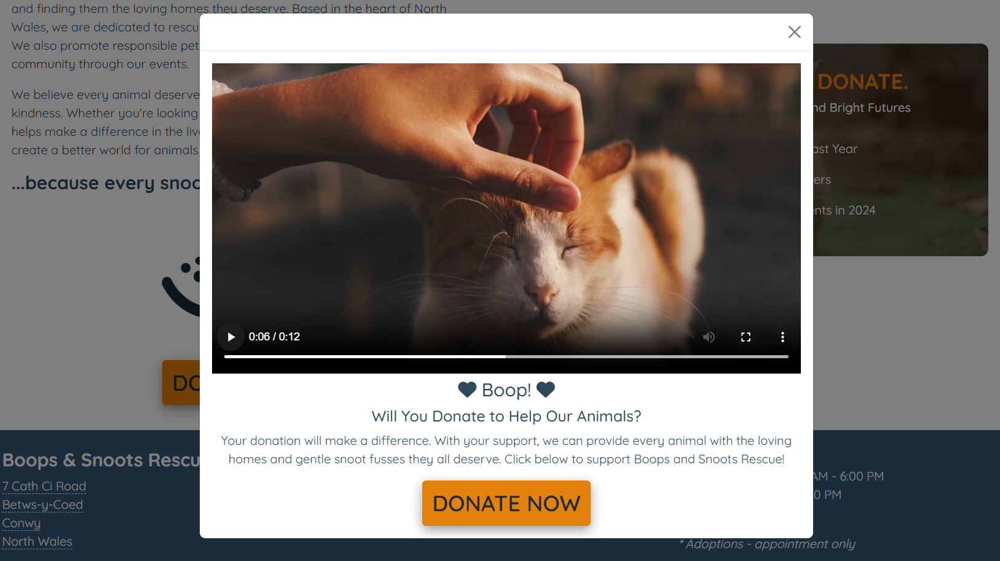

## Technologies Used

### Languages, Frameworks & Tools

#### Languages & Frameworks:

- **HTML** – Provides the structure and content of the website.
- **CSS** – Used for styling, including custom hover effects and branding elements.
- **Bootstrap** – Utilised for a responsive, mobile-friendly layout, with custom styling applied to elements such as the navbar, buttons, and modals.
- **JavaScript** – Used for form validation (restricting input to numbers on forms).

#### Development Tools:

- **GitHub** – Used for version control, tracking changes, and hosting the project repository.
- **Visual Studio Code** – The primary code editor for developing the site.
- **Chrome Developer Tools** – Used for debugging, inspecting elements, and testing responsive design in real time.
- **Am I Responsive** – Checked responsiveness across different screen sizes and took preview screenshots.

#### Design & UI Tools:

- **Balsamiq Wireframes** – Used for planning and sketching the website layout.
- **Coolors** – Helped generate and refine the site’s colour palette.
- **WebAIM Contrast Checker** – Ensured accessible colour contrast for readability.
- **Eye Dropper (Chrome Extension)** – Used to extract and match colours from images.
- **Google Fonts** – Used to enhance the site's typography with custom fonts.
- **Font Awesome** – Provides scalable icons used for social media links and other design elements.
- **Favicon Generator** – An online tool used to create and implement a custom favicon for the site.

#### Testing & Validation Tools:

- [**W3C Markup Validator**](validator.w3.org) – Ensured valid HTML code.
- [**W3C CSS Validator**](jigsaw.w3.org/css-validator) – Checked for valid CSS.
- [**Autoprefixer**](autoprefixer.github.io) – Added necessary vendor prefixes for better browser compatibility.

#### Additional Tools:

These tools were used for planning, content writing, design, and proofreading:

- **Todoist** – For managing personal tasks and tracking project progress.
- **Microsoft OneNote & Word** – Used to organise content, draft text, and structure ideas.
- **Grammarly** – Assisted with proofreading and refining written content.
- **Adobe Photoshop & Illustrator** – Used for image editing and creating branding elements.
- **DALL·E (AI Image Generation)** – Used as a brainstorming tool for initial logo ideas, but all final design work was edited and customised in Adobe Photoshop and Illustrator.
- **ChatGPT** – Used as a writing aid to help refine and structure text.

## Testing

The website has been thoroughly tested to ensure functionality, accessibility, and responsiveness. All HTML and CSS have passed validation checks without errors, and Lighthouse scores are excellent across performance, accessibility, best practices, and SEO. Additionally, multiple bug fixes and improvements were made during development to enhance the user experience.

For a detailed breakdown of the testing process, including validation results, Lighthouse scores, and a list of bug fixes, please refer to [TESTING.md](TESTING.md)

## Deployment

### Creating The Repository on GitHub

1. First, make sure you are signed into GitHub.
2. Go to the Code Institute template, which can be found [here](https://github.com/Code-Institute-Org/ci-full-template).
3. Click on **Use this template** and select **Create a new repository** from the drop-down.
4. Enter a name for your repository and click **Create repository from template**.
5. Open VS Code and connect your GitHub account:

- Click on the Accounts icon in the bottom-left corner of VS Code.
- Sign in to GitHub and authorize VS Code.
- Open the repository in VS Code using Remote Repositories:
- Click on the Source Control tab (or press Ctrl + Shift + G).
- Click "**Clone Repository**" and select GitHub.
- Find your repository and select it.
- Choose a location on your machine where you want to store the project.
- Click Open in VS Code once cloning is complete.

### Alternative: Manual Deployment via Terminal

For those who prefer the git bash terminal, the following commands can be used:

1. Initialize a Git repository (if not already initialised)
   `git init`

2. Add all files to the staging area
   `git add .`

3. Commit the changes with a descriptive message
   `git commit -m "Initial commit"`

4. Connect the local repository to GitHub (only needed if not already linked) Replace YOUR-USERNAME/YOUR-REPO eg. https://github.com/Seren-Hughes/boops-and-snoots-rescue.git
   `git remote add origin https://github.com/YOUR-USERNAME/YOUR-REPO.git`

5. Push the changes to the main branch
   `git push -u origin main`

Whenever updates are made, they can be pushed using:

- Add the changes:
  `git add .`

- Commit with a message:
  `git commit -m "Update features and bug fixes"`

- Push to GitHub:
  `git push`
  or to branch origin:
  `git push origin main`

### The site was deployed to **GitHub Pages** using the following steps:

1. Go to the **GitHub repository**.
2. Click on the **Settings** tab.
3. Scroll down to the **"Pages"** section in the left sidebar.
4. Under **"Branch"**, select `main` (or the branch you want to deploy).
5. Click **Save**.
6. After a few moments, GitHub Pages will generate a link to your live site.

---

## Stretch Goals

As part of the initial planning phase, I identified additional pages and features that would enhance the website experience:

- **About Page** – A section detailing the organisation's history and mission.
- **Volunteer Page** – Information on volunteer roles, benefits, and how to apply. This page was also intended to include an application form for volunteers and an accordion-style FAQ section to address common questions about volunteering.
- **Gallery of Success Stories** – A collection of adopted animals and their happy endings.
- **Events Section** – A showcase of past fundraising events and a link to social media for updates.

I created wireframes and wrote content for these pages; however, during development, I reassessed the project scope and prioritized completing core features, validation checks, and ensuring overall site stability. Given that CSS changes could have a site-wide impact, I made the strategic decision to avoid last-minute additions that might introduce unintended issues.

These pages remain stretch goals for future development, and their wireframes are included below for reference:

About Page Wireframes. Click to view

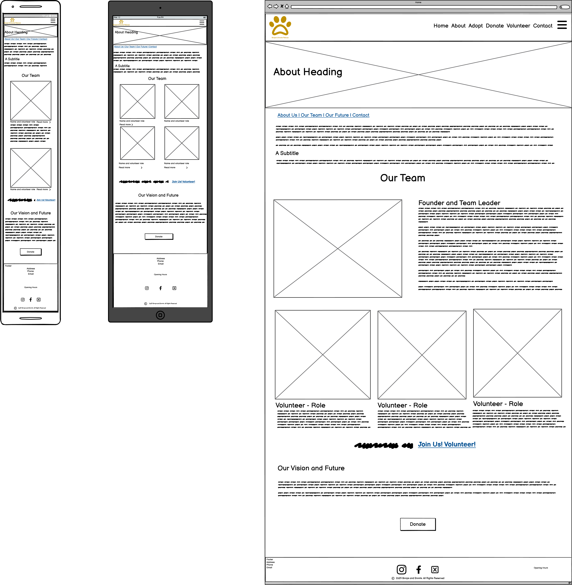

Volunteer Page Wireframes. Click to view

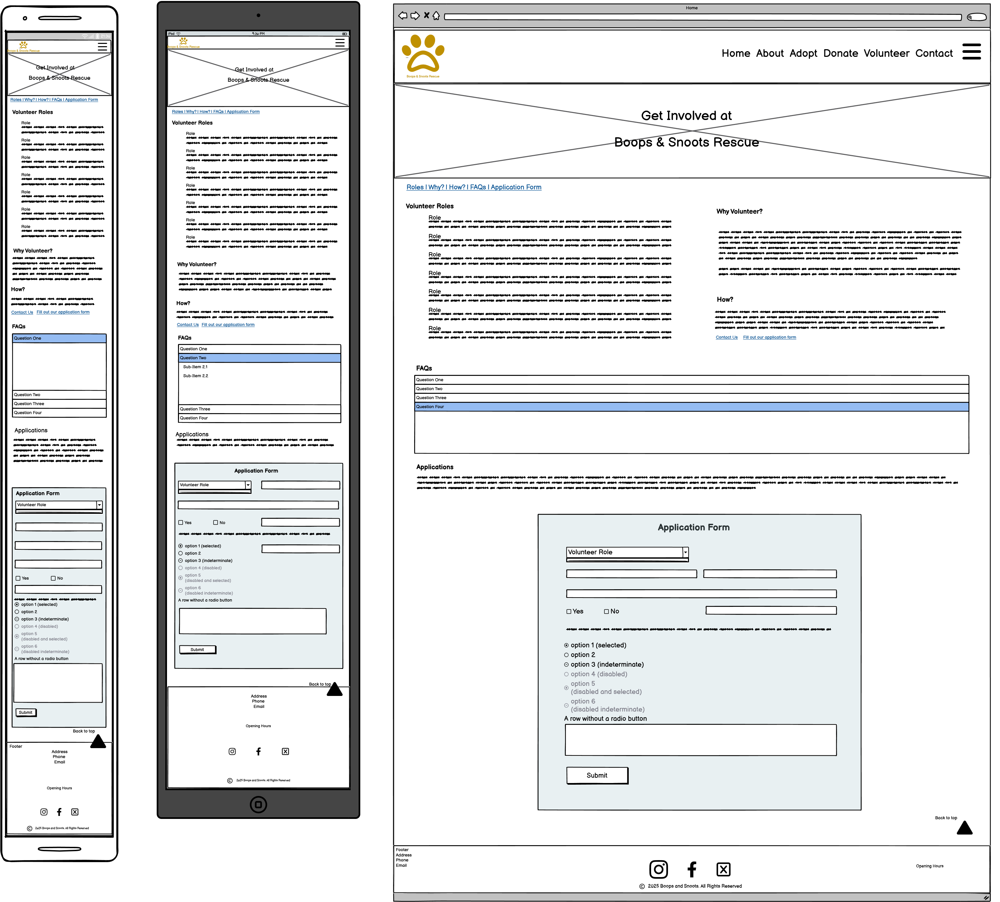

Gallery Success Stories Page Wireframes. Click to view

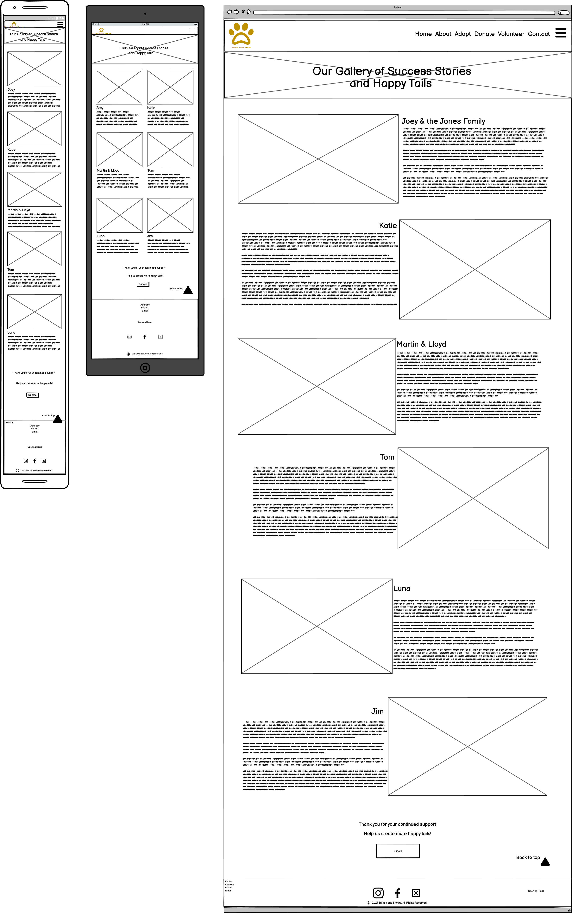

Events Page Wireframes. Click to view

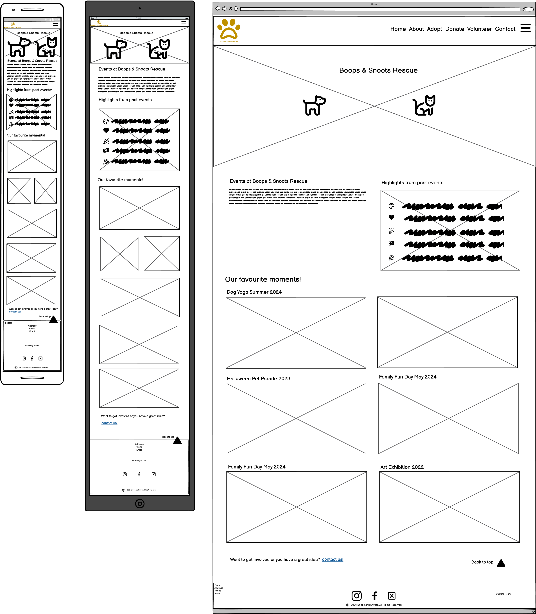

## Future Enhancements

Since this is a static site, potential future updates could include:

- **Content Management System (CMS):** Allowing non-developers to easily update adoptable animals, events, and volunteer information without editing the code.
- **User Accounts & Applications:** Personalized experiences where potential adopters and volunteers can create accounts, submit applications, and track their progress.
- **API Integration:** Real time updates on adoptable animals and upcoming events.
- **Search & Filter Features:** A dynamic database allowing users to search for pets based on criteria such as age, breed, child-friendliness, and compatibility with other pets.
- **Online Donation Processing:** Integrated payment platforms for direct donations.
- **Enhanced Interactivity:** Features like regular blog updates to engage the community.
- **Newsletter Signup:** An email subscription system for updates, events, and adoption stories.
- **Merchandise Store:** Selling branded items like t-shirts and mugs to raise funds and increase brand visibility.
- **Interactive Event Calendar:** A live-updating calendar where users can register for upcoming fundraising and adoption events.
- **Community Forum or Blog:** A space for adopters to share updates and for the rescue to post success stories and training tips.

As Boops & Snoots Rescue continues to grow — welcoming more animals, expanding to new locations, and increasing its reach — the demand for these enhancements would naturally increase. While this project remains a static website, these theoretical future updates would improve usability, streamline the adoption process, and provide more ways for supporters to engage with and contribute to the organisation.

## Credits

### Code & Text Content

- **README Outline:** [tmarkec/README-MS1](https://github.com/tmarkec/README-MS1) (Used as a reference for structuring the README file)
- **Kera Cudmore's README Guide:** Referenced Kera Cudmore’s fantastic guide for structuring the README file, which I found on [GitHub](https://github.com/kera-cudmore/readme-examples). This was shared by a fellow student during a weekly Code Institute class standup call.
- **Code Institute Tutorials & Walkthrough Projects:** Referenced approaches and steps from Code Institute’s _Love Running_ and _Boardwalk Games_ projects as guidance for structuring and building the website.
- **Bootstrap Documentation:** Extensively referenced for layout, gutters, forms, and general styling.
- **Bootstrap Navbar Styling Tips:** [Noble Desktop](https://www.nobledesktop.com/learn/front-end-web-development/styling-a-navbar-with-bootstrap-tips-and-tricks)
- **Bootstrap Cursor Pointer Customization:** [Scaler](https://www.scaler.com/topics/cursor-pointer-bootstrap/)
- **Increasing Cursor Size:** [Stack Overflow](https://stackoverflow.com/questions/27351916/increase-cursor-size-in-html-body#:~:text=You%20can't%20increase%20the,Javascript%2FjQuery%20hack%20for%20this.)
- **noopener vs noreferrer Explanation:** [MDN Web Docs](https://developer.mozilla.org/en-US/docs/Web/HTML/Link_types/noopener)
- **Phone Number Input Validation:** Used solutions from [Stack Overflow 1](https://stackoverflow.com/questions/67903970/how-do-i-accept-only-numbers-and-reject-letters-for-input-tel), [Stack Overflow 2](https://stackoverflow.com/questions/8936018/limit-input-to-numbers-and-on-input-field) and [MDN Web Docs](https://developer.mozilla.org/en-US/docs/Web/HTML/Element/input/tel#validation) Used a combination of `pattern` attributes and JavaScript to ensure only numeric characters are accepted in the phone number input field while keeping `type="tel"`. 
- **Custom Box Shadows:**
  - Inspiration & techniques: [Josh W. Comeau](https://www.joshwcomeau.com/css/designing-shadows/)
  - Professional CSS techniques: [Nick Haralampopoulos](https://nick-haralampopoulos.medium.com/how-to-write-css-like-a-professional-best-techniques-to-get-from-idea-to-polished-result-b1c8066d3303)
  - **Box Shadow Effect:** [LogRocket Blog](https://blog.logrocket.com/styling-css-box-shadow-property/) – Used as a reference and adapted for the **Donate and Home Buttons**.
- **Image Overlay with Colour:**
  - [Stack Overflow](https://stackoverflow.com/questions/18815157/how-to-overlay-image-with-color-in-css)
  - [HubSpot Community](https://community.hubspot.com/t5/CMS-Development/Adding-a-colour-overlay-to-an-image/m-p/780238)
- **Hover Effect Speed Adjustment:** [TutorialsPoint](https://www.tutorialspoint.com/set-the-speed-of-the-hover-effect-with-css#:~:text=To%20set%20the%20speed%20of%20the%20hover%20effect%2C%20we%20have,initial%20appearence%20of%20the%20button.)
- **Hover Effect Zoom:** [W3Schools](https://www.w3schools.com/howto/howto_css_zoom_hover.asp)
- **Scrollbar Styling for Mobile & Tablet:** [MDN Web Docs](https://developer.mozilla.org/en-US/docs/Web/CSS/::-webkit-scrollbar) for pseudo-classes and implementation.
- **Image Conversion:** Used [FreeConvert.com](https://www.freeconvert.com/) to convert images to WebP format for better performance and optimization.
- **Google Fonts:** Used [Google Fonts](https://fonts.google.com/selection/embed) to import custom fonts for the website's design.
- **Favicon.io:** Used [Favicon.io](https://favicon.io/favicon-converter/#google_vignette) to create and add a favicon to the website by copying and pasting the code into the header.
- **Responsive Banner Image:** Referenced solutions from [Stack Overflow](https://stackoverflow.com/questions/39968620/responsive-banner-image-for-all-resolutions) and [Stack Overflow](https://stackoverflow.com/questions/40847247/trying-to-make-banner-image-responsive) for making the banner image responsive across all screen sizes.
- **Horizontal Line in CSS:** Referenced a solution from [Stack Overflow](https://stackoverflow.com/questions/35036185/adding-horizontal-line-below-the-text-like-in-the-image) for adding a horizontal line below text.
- **Phone Number Link (Tel Link):** Used the approach from [Stack Overflow](https://stackoverflow.com/questions/1608548/how-to-trigger-a-phone-call-when-clicking-a-link-in-a-web-page-on-mobile-phone) to create a clickable phone number link for mobile devices.
- **Changing Image Size in Markdown:** Used solutions from [Stack Overflow](https://stackoverflow.com/questions/14675913/changing-image-size-in-markdown) to adjust image sizes in markdown.
- **Autocomplete Attributes:** Referenced [DigitalA11Y](https://www.digitala11y.com/what-are-the-autocomplete-attributes-defined-in-1-3-5-input-purpose/) and [MDN Web Docs](https://developer.mozilla.org/en-US/docs/Web/HTML/Attributes/autocomplete#try_it) for guidance on autocomplete attributes for form inputs.
- **HTML & CSS Validation:** Used [W3C HTML Validator](https://validator.w3.org/) and [W3C CSS Validator](https://jigsaw.w3.org/css-validator/) to check for errors and ensure clean, valid code.
- **Autoprefixer:** Utilised [Autoprefixer](https://autoprefixer.github.io/) to add vendor prefixes and improve browser compatibility.
- **Code Institute Mentor – Daniel Hamilton:** Gained valuable insights from reviewing two of their projects, [_Bomb Catcher_](https://github.com/dlhamilton/Bomb-Catcher) and [_LPSB-Learn-GCSE-CS_](https://github.com/dlhamilton/LPSB-Learn-GCSE-CS). They shared a helpful CSS commenting method that involves clear sectioning using box-like comments, which I adapted for my own project. Additionally, I followed their professional approach to Git commits, using structured prefixes like `add:`, `fix:`, `docs:` etc.
- **Code Institute Slack Channel:** Found valuable resources and support through the **Code Institute Slack channel**, where fellow students shared helpful links, insights, and guidance.

## Media

### **Images**

- **Adobe Stock** (standard license)
  - Nose vector used on [Home page] By Siarhei [Link to the image](https://stock.adobe.com/uk/images/pet-face-with-smile-and-heart-simple-minimal-vector-drawing/1112221323?prev_url=detail)
  - Cat vector image used on [404 page] by sudowoodo [Link to the image](https://stock.adobe.com/uk/images/cat-knocking-plant-off-table/467715156?prev_url=detail)
  - Plain t-shirt used for mockup on [Donate Page] by Kay [Link to the image](https://stock.adobe.com/uk/images/t-shirt-mockup-white-blank-t-shirt-front-and-back-views-male-clothes-wearing-clear-attractive-apparel-tshirt-models-template-generative-ai/624964071)
- **Freepik**

  - Brown kitten image on [Home page - Impact Highlights Section] by wirestock from Freepik
    [Link to the image](https://www.freepik.com/free-photo/closeup-shot-brown-kitten-ground_17087909.htm)
  - Shelter dogs image on [Donate Page] by Freepik
    [Link to the image](https://www.freepik.com/free-photo/woman-playing-with-cure-rescue-dogs-shelter_10295908.htm)
  - Custom pointer design used on [Home page] by Freepik [Link to the image](https://www.freepik.com/free-vector/flat-design-mouse-cursor-set_84412414.htm#fromView=search&page=1&position=13&uuid=c2678186-d41b-48d5-be7f-c50503851190&query=Hand+Cursor+)

- **Pixabay**

  - Puppy running on country lane on [Home / Index page hero banner] by zoegammon from Pixabay [Link to the image](https://pixabay.com/photos/puppy-yorkie-dog-pet-canine-4608266/)

  - PayPal logo vector used on [Donate page] by CopyrightFreePictures from Pixabay [Link to the image](https://pixabay.com/vectors/paypal-logo-brand-pay-payment-784404/)

- **Pexels**

  - Black and brown dog in arms on [Adopt page] by Kaboompics.com from Pexels [Link to the image](https://www.pexels.com/photo/girl-caressing-her-black-and-brown-dog-7693565/)

  - Close up of orange tabby kitten on [Adopt page] by Hiang Kanjinna from Pexels [Link to the image](https://www.pexels.com/photo/close-up-photo-of-orange-tabby-cat-1629062/)

  - Kittens in crate on [Adopt page] by Carolina Almeida from Pexels [Link to the image](https://www.pexels.com/photo/kittens-inside-the-cage-12474327/)

- **Unsplash**

  - Close up of puppy on [Adopt page] by Nathaniel Bowman from Unsplash [Link to the image](https://unsplash.com/photos/short-coated-black-dog-DCOH4VDnEQU)

- **JustGiving**
  - JustGiving brand logo used on [Donate page] by JustGiving from Media Assets [Link to the image](https://www.justgiving.com/media-centre/media-assets)

### **Video**

- **Pexels**
  - Video of person petting orange cat on [Index page - modal] by ROMAN ODINTSOV from Pexels [Link to the video](https://www.pexels.com/video/a-person-petting-a-cat-5668810/)

### **Icons and Fonts**

- FontAwesome – Used for icons across the site.

- Favicon Generator – Used to create the website’s favicon.

- Google Fonts:
  - Quicksand Designed by Andrew Paglinawan used for typography.
  - Lato Designed by Łukasz Dziedzic used for typography.

## Acknowledgments

This project has been an incredibly rewarding experience and I have loved every step of the journey. I am immensely grateful for the opportunity to apply my skills while building Boops & Snoots Rescue and for the incredible support I've received along the way.

- Daniel Hamilton – My mentor, whose invaluable guidance, constructive feedback, and encouragement have made a real difference throughout this project. His professionalism and expertise set a standard I truly admire.
- Marko Tot – Code Institute Facilitator, for the insightful weekly stand-up calls, where he shared his expertise, advice, and feedback.
- My fellow students – For their camaraderie, motivation, and fun coding discussions in our weekly stand-up calls, as well as the invaluable support and knowledge-sharing in the Code Institute Slack channel.

A heartfelt thank you to everyone who has contributed to my learning and growth during this milestone project!
