# BOOPS & SNOOTS RESCUE - TESTING

## Table Of Contents:
1. [Google Lighthouse Performance](#googles-lighthouse-performance)
2. [Browser Compatibility](#browser-compatibility)
3. [Responsiveness](#responsiveness)
4. [Code Validation](#code-validation)
5. [Manual Testing](#manual-testing)
    * [User Stories](#user-stories)
    * [Other Features](#manual-testing-other-features)
6. [Bugs](#bugs)

## Google's Lighthouse Performance

### Index Page:

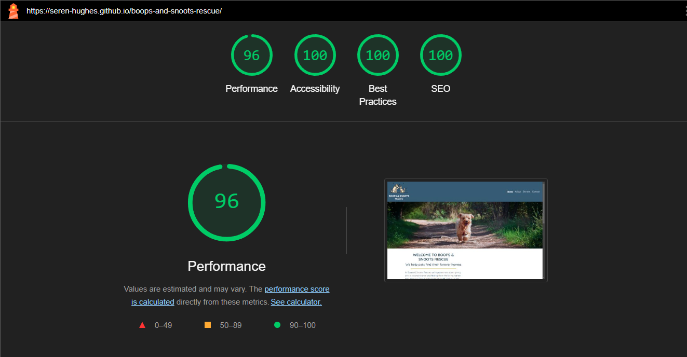

### Browser Compatibility
Check compatability with different browsers
### Responsiveness
Screenshots of the responsivness, pick few devices (from 320px top 1200px)

---

## **Code Validation**
### HTML W3C Validation

- **Index Page:** [Document checking completed. No errors or warnings to show.](https://validator.w3.org/nu/?doc=https%3A%2F%2Fseren-hughes.github.io%2Fboops-and-snoots-rescue%2Findex.html)

- **Adopt Page:** [Document checking completed. No errors or warnings to show.](https://validator.w3.org/nu/?showsource=yes&useragent=Validator.nu%2FLV+https%3A%2F%2Fvalidator.w3.org%2Fservices&acceptlanguage=&doc=https%3A%2F%2Fseren-hughes.github.io%2Fboops-and-snoots-rescue%2Fadopt-info.html)  

- **Donate Page:** [Document checking completed. No errors or warnings to show.](https://validator.w3.org/nu/?doc=https%3A%2F%2Fseren-hughes.github.io%2Fboops-and-snoots-rescue%2Fdonations.html)

## **Manual Testing**
### User Stories:

### Home Page User Story: 
> "As someone visiting the website, I want to easily understand what the organization is about, find information about available animals, learn about the adoption process (including fees), how to get involved or donate, and quickly access contact details, location, and opening hours so I can plan my visit or make enquiries."

#### Test Cases:                                 
| **Goal**                                     | **How are they achieved?**                                                                                      | **Passed** |
|----------------------------------------------|-----------------------------------------------------------------------------------------------------------------|--------------|
| **Clear Organisation Purpose**                   |                                                                                                                 |  |
| The homepage clearly states the purpose of the organisation. | The user sees a hero section with a welcoming message and an introduction to Boops & Snoots Rescue.            | ✅ |
| **Easy Navigation**                              |                                                                                                                 |  |
| Navigation links to key sections (Adoption, Donations, Contact). | The navigation bar is visible at the top and provides easy access to relevant pages.                            | ✅ |
| **Adoption & Animal Information**               |                                                                                                                 |  |
| Information about available animals and the adoption process is accessible. | The homepage links to an adoption section where users can learn about adoption requirements and fees.            | ✅ |
| **Donation Options**                             |                                                                                                                 |  |
| Donation options are clearly explained.         | The homepage features a call to action button and modal, which take users to the donate page with all relevant details. | ✅ |
| **Contact & Location Information**              |                                                                                                                 |  |
| Contact details, location, and opening hours are easily found. | The footer contains the organisation's contact information, opening hours, and address.                         | ✅ |

#### Screenshots:

Navigation to key sections including adoption. Click to see screenshots

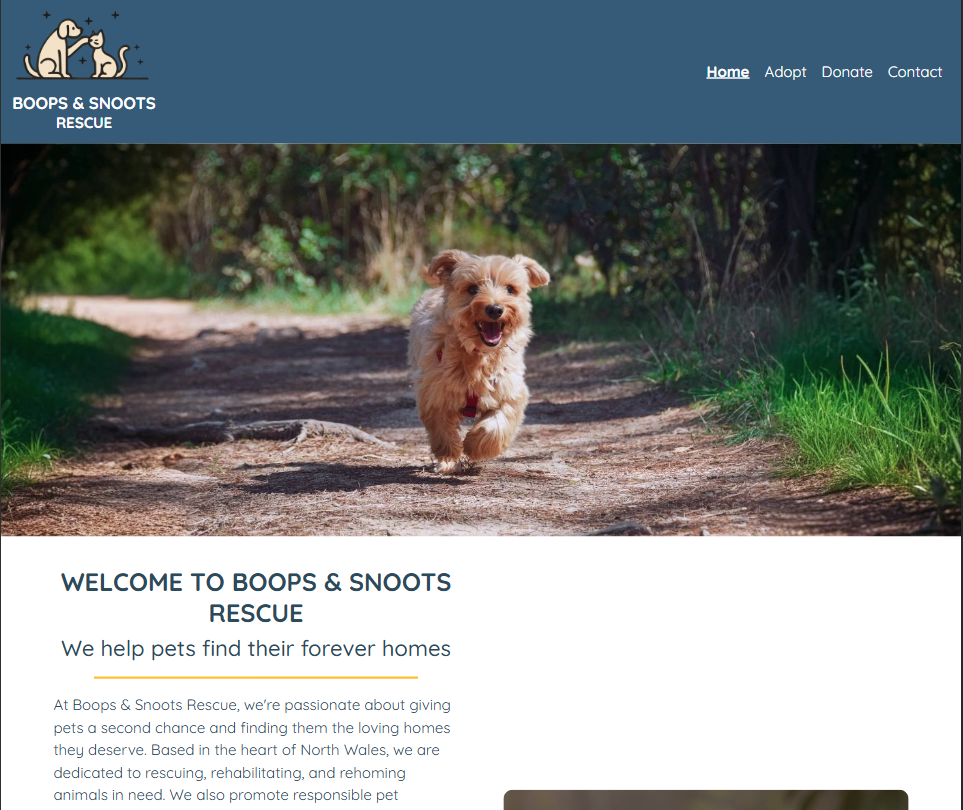

Purpose of the organisation. Donation link. Click to see screenshots

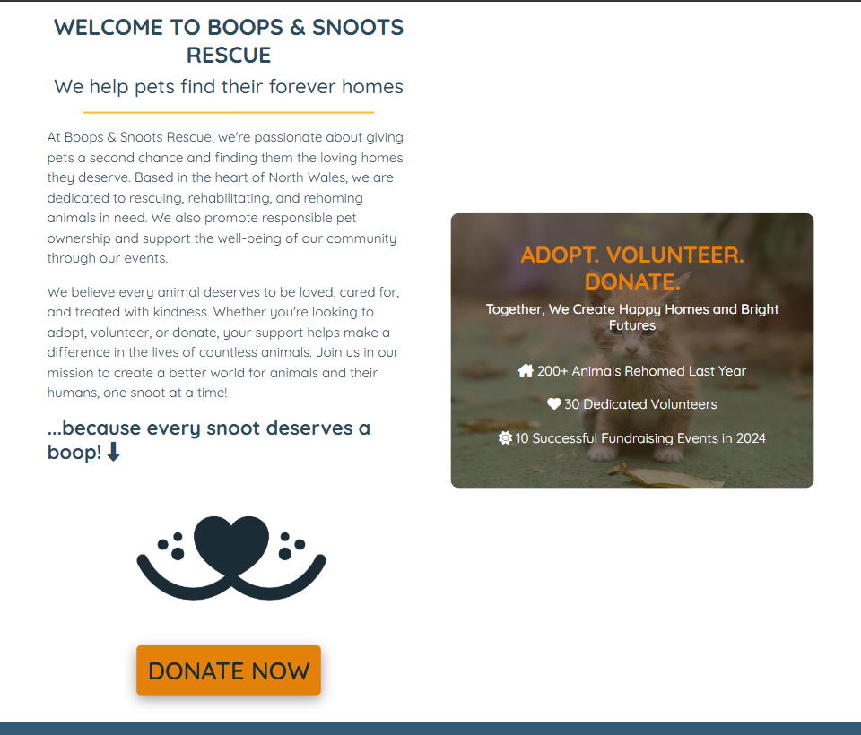

Contact details, location, and opening hours. Click to see screenshots

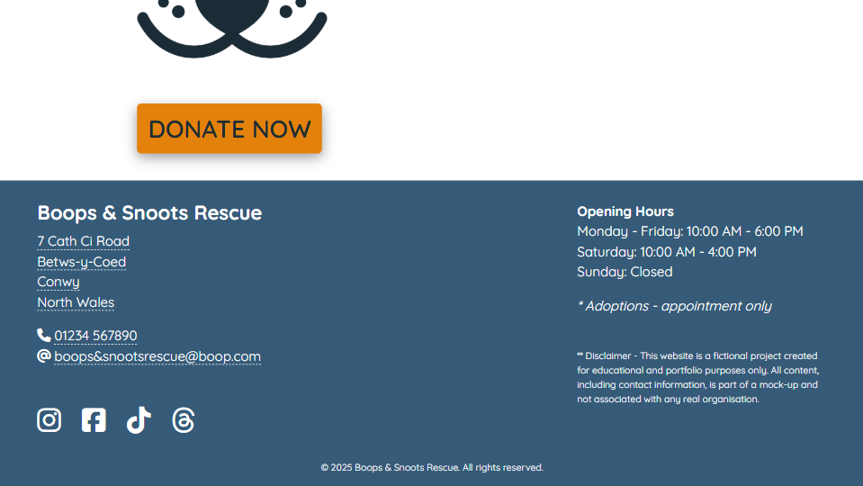

--- 

### Donations User Stories

#### User Stories:
> "As a pet owner, I want to donate items like unused pet food to help the shelter and avoid waste."  

> "As a visitor to the site, I want to know what items the shelter needs so I can contribute effectively."  

> "As someone who wants to support the organization financially, I want clear information on how to donate money, so I can contribute easily and confidently."  

#### Test Cases:

| **Goal**                                     | **How are they achieved?**                                                                                      | **Passed** |
|----------------------------------------------|-----------------------------------------------------------------------------------------------------------------|--------------|
| **Physical Donations**                        |                                                                                                                 |  |
| Users can find out what items the shelter needs. | The donations page lists accepted physical donations like food, bedding, and toys.                              | ✅ |
| Users know how and where to drop off physical donations. | Clear instructions are provided on when and where to bring donations (e.g., opening hours and location details). | ✅ |
| **Monetary Donations**                        |                                                                                                                 |  |
| Users can easily find information on how to donate money. | The donations page includes links to PayPal and JustGiving with clear donation instructions.                     | ✅ |
| **Encouraging Support**                       |                                                                                                                 |  |
| The website provides a call-to-action encouraging donations. | A donate link is featured in the navigation bar and donate button is prominently on the home page including the modal encouraging support.                         | ✅ |

#### Screenshots:

Monetary and item list donations. Click to see screenshots

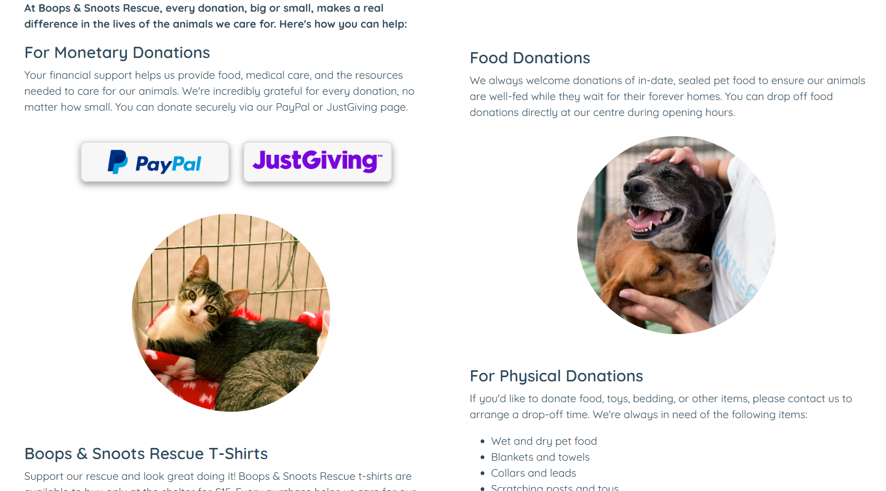

Encouraging support calls to action. Click to see screenshots

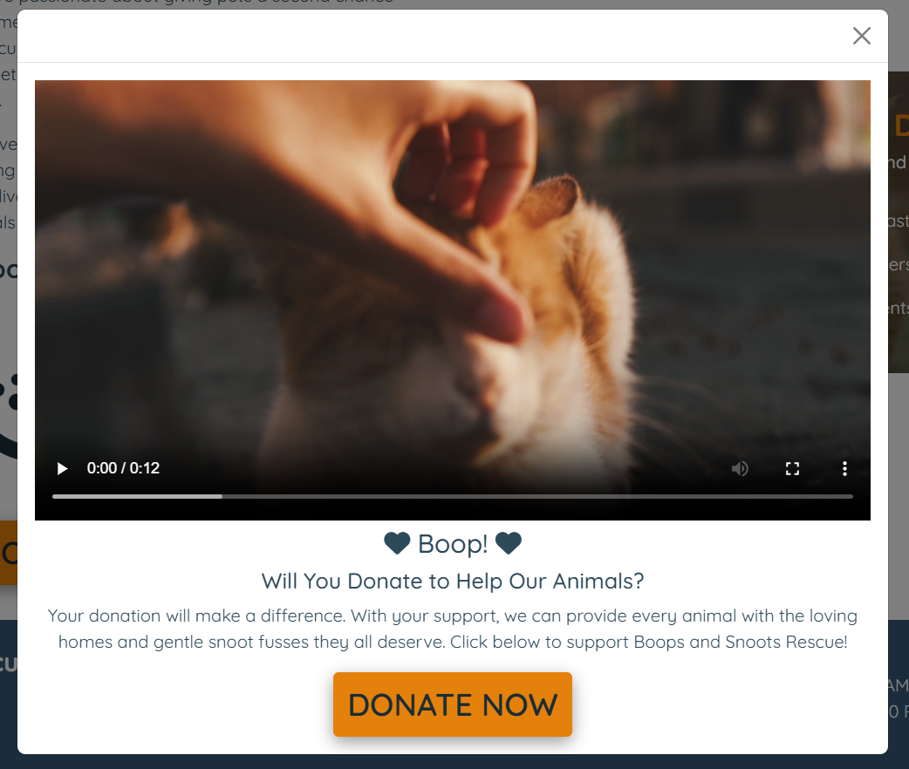

--- 

### Adoptions User Stories

#### User Stories:
> "As someone looking to adopt, I want to find out how I can find a pet, understand the adoption process (including costs and requirements), and easily find contact information to speak to someone about adoptions or ask questions." 

> "As someone adopting a pet, I want to know where the shelter is located and its opening hours so I can plan my visit."  
> "As someone adopting a pet, I want to feel confident that the animal I adopt has been assessed for health and behaviour, ensuring it is ready for a safe and happy transition into my home—especially if I have children."  

> "As someone looking to adopt or foster an animal, I want an online application form so that I can easily provide my details and speed up the process of being matched with a suitable pet."  

#### Test Cases:

| **Goal**                                     | **How are they achieved?**                                                                                          | **Passed** |
|----------------------------------------------|-----------------------------------------------------------------------------------------------------------------|--------------|
| **Finding Adoption Information**                 |                                                                                                                     |  |
| Users can easily access adoption information.    | The adoption page provides details on how to find adoptable pets via Facebook and Instagram or by contacting the shelter. | ✅ |
| Users can contact the shelter with questions.    | Contact details are available on all pages in the footer. The adoption page includes an on-page text link directing users to the footer for contact information.                                               | ✅ |
| **Planning a Visit**                              |                                                                                                                     |  |
| Users can find the shelter’s location and hours. | The contact page and footer include the full address, opening hours, phone number and email.       | ✅ |
| **Confidence in Adoption Process**               |                                                                                                                     | |
| Users are assured about pet health and behaviour. | The adoption page explains that pets receive vet checks, vaccinations, and behaviour assessments before adoption.    | ✅ |
| **Adoption Application**             |                                                                                                                     |  |
| Users can submit an online application.         | An adoption form is available on the adoption page to collect essential details, speeding up the interview process. | ✅ |

#### Screenshots:

Adopting information. Click to see screenshots

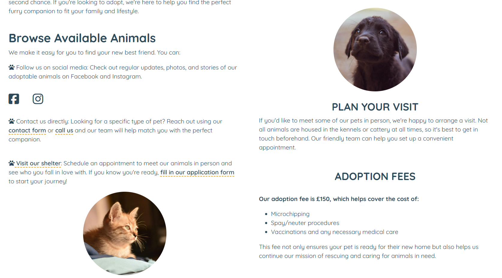

Confidence and trust in shelters adoption process. Click to see screenshots

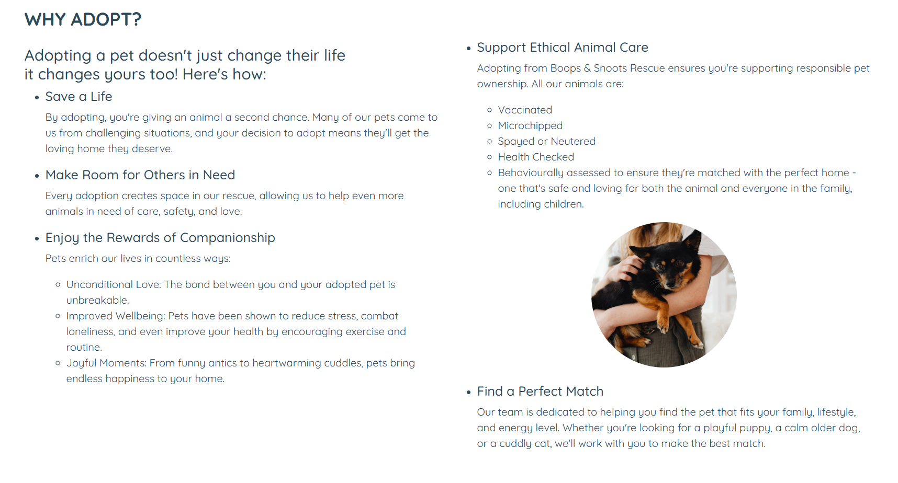

Adopt application form. Click to see screenshots

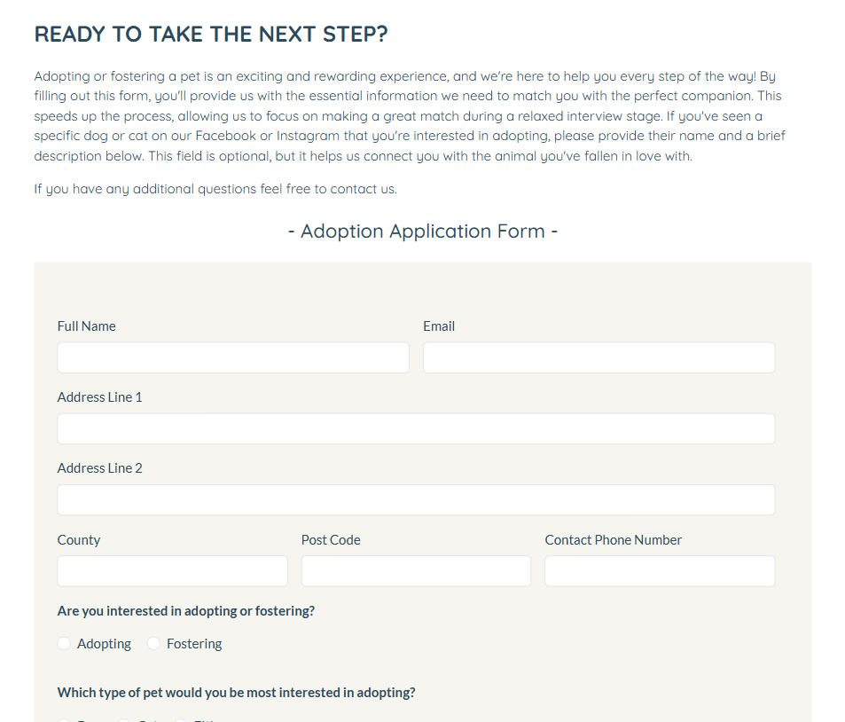

---

### Contact User Stories:
>"As a visitor to the website, I want to easily find contact information so that I can quickly get in touch with the organisation for general inquiries."

>"As someone wanting to ask a question, I want a simple enquiry form so I can send a message without needing to email directly."

>"As a potential visitor, I want to know the organisation’s location, phone number, and opening hours so I can plan my visit."
>"As a social media user, I want links to the organisation’s social accounts so I can follow updates and message them through my preferred platform."

>"As a user visiting the website, I want a disclaimer that explains the website is fictional so I understand its purpose and context."

#### Test Cases:

| **Goal**                                         | **How are they achieved?**                                                                                      | **Passed** |
|--------------------------------------------------|-----------------------------------------------------------------------------------------------------------------|--------------|
| **Finding Contact Information**                  |                                                                                                                 |  |
| Easily locate general contact details.           | The footer contains the organisation's contact email and phone number.                                          | ✅ |
| **Enquiry Form**                                 |                                                                                                                 |  |
| A simple form for users to send enquiries.       | The contact page includes an easy-to-use enquiry form with fields for name, email, and message.                 | ✅ |
| **Location & Opening Hours**                     |                                                                                                                 |  |
| Access to address, phone number, and opening hours. | The footer and contact page display the location, phone number, and opening hours.                             | ✅ |
| **Social Media Links**                           |                                                                                                                 |  |
| Easily follow the organisation on social media.  | The footer and contact page provide links to Facebook, Instagram, TikTok and Threads social platforms.         | ✅ |
| **Fictional Website Disclaimer**                 |                                                                                                                 |  |
| Users understand the website is fictional.       | A disclaimer is placed in the footer, stating that the website is for educational and portfolio purposes only.  | ✅ |

#### Screenshots:

Contact form. Click to see screenshot

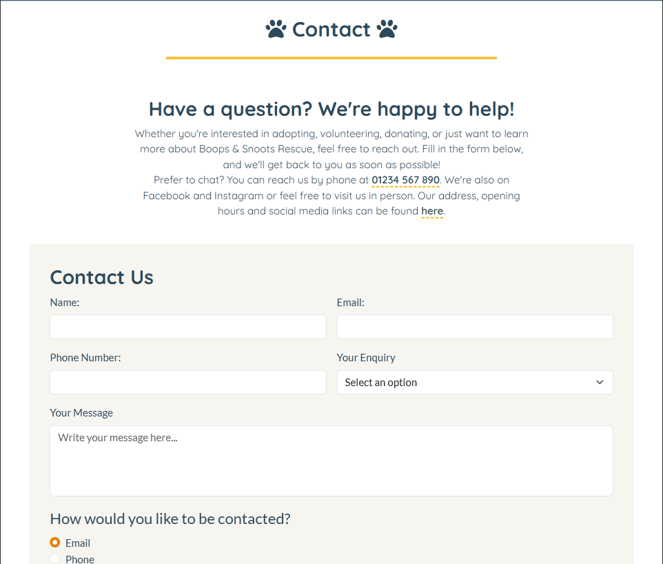

---

### Manual Testing Other Features:

---

## Bugs
 
 🐞 **Home | Index Page** 🐛

Accessibility & Usability Improvements

- **Issue:** Used width="100%" directly on the video element. The validator flagged this as an invalid attribute value.
- **Fix:** Moved the width: 100% styling to CSS instead of using an inline attribute.
- **Result:** Ensured proper styling while maintaining valid HTML.

---

- **Issue:** aria-labelledby attribute was used incorrectly without referencing an existing ID.
- **Fix:** Replaced aria-labelledby with aria-label="Donate Now" where needed.
- **Result:** Improved screen reader accessibility by providing a clear label for interactive elements.

---

- **Issue:** a elements had an invalid type="button" attribute.
- **Fix:** Removed type="button" from a elements and kept role="button" where appropriate.
- **Result:** Ensured valid HTML while maintaining accessible button-like behaviour for links.

---

- **Issue:** Missing role="button" on modal-triggering links.
- **Fix:** Added role="button" to a elements that function as buttons, such as those opening modals.
- **Result:** Enhanced keyboard navigation and screen reader compatibility.

---

- **Issue:** Unclosed div tags, which could cause layout issues and unexpected behaviour.
- **Fix:** Identified and properly closed all div tags.
- **Result:** Improved structural integrity of the HTML, preventing rendering errors.

---

🐞 **Adopt Page** 🐛

Incorrectly nested and unclosed div and section elements 

- **Issue:** W3C HTML Validator flagged errors due to unclosed div and section tags, and the use of section elements where no heading was needed.
- **Fix:** Closed all open tags correctly and replaced unnecessary section elements with div to ensure proper document structure.
- **Result:** The page now passes W3C validation without errors.

Accessibility & Usability Improvements:

- **Issue:** Missing autocomplete attributes in forms. Lighthouse flagged the absence of autocomplete attributes on some form fields, which can improve user experience by enabling browser suggestions.
- **Fix:** Added appropriate autocomplete values (e.g., "name", "email", "address") to form fields.
- **Result:** Improved form usability and accessibility.

Improved screen reader compatibility for forms

- **Issue:** Lighthouse flagged accessibility concerns related to form structure, specifically missing context for screen readers.
- **Fix:** Added fieldset and legend elements to group related form fields logically.
Used CSS (from 'Inclusively Hidden' by Scott O'Hara) to visually hide a legend while keeping it accessible to screen readers.
- **Result:** The form is now better structured for assistive technologies without altering the visual layout.

---

🐞 **Donate Page** 🐛

Accessibility & Usability Improvements

- **Issue:** Incorrect image path format (\ instead of /) flagged by W3C HTML Validator .
- **Fix:** Updated all image paths to use forward slashes (/) for proper cross-platform compatibility.
- **Result:** Ensured images load correctly across different operating systems and browsers.

---

- **Issue:** Duplicate id attributes on donate-image and donate-sub-heading.
- **Fix:** Changed the duplicate IDs to classes and updated the corresponding styles in style.css.
- **Result:** Ensured valid HTML and improved maintainability by following best practices for class-based styling.

---

#### Video Thumbnail on Mobile
**Issue:** The video modal did not display a thumbnail on iPhone (Safari/Chrome).

**Expected Outcome:** The video should show a preview image before playback.

**Fix Implemented:**
Added the poster attribute to the video element to specify a preview image.

**Result:** The thumbnail now appears correctly on all devices.

#### **iPhone Screenshots:**

Before

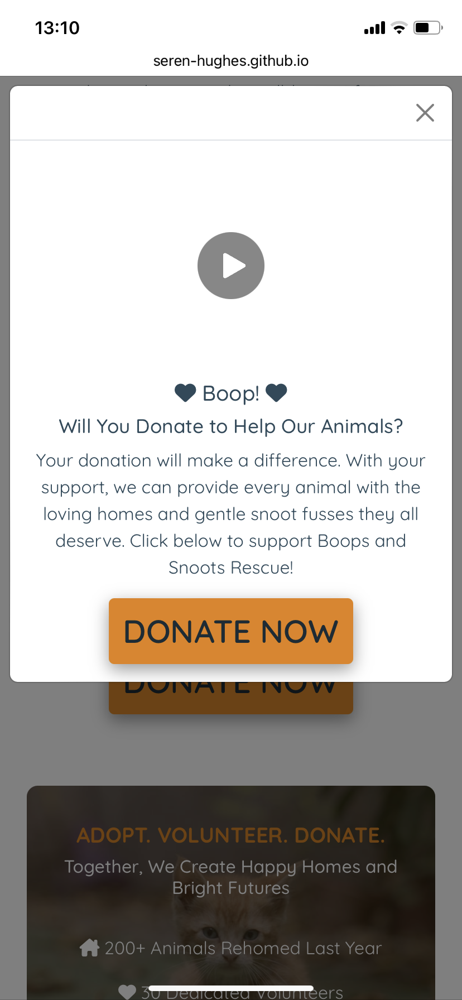

Fix on Chrome iPhone

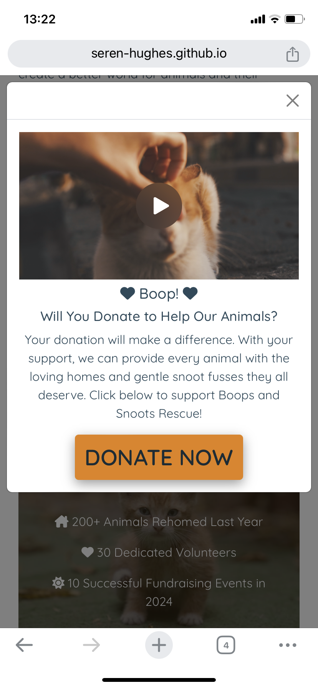

Fix on Safari iPhone

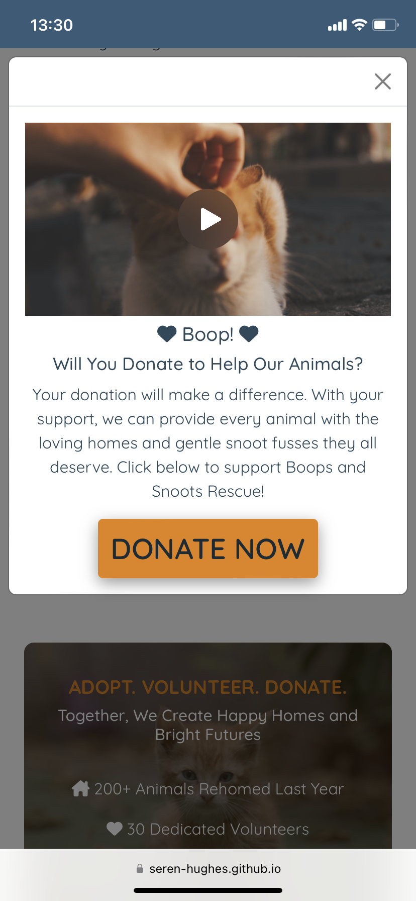

Fix on Safari iPad

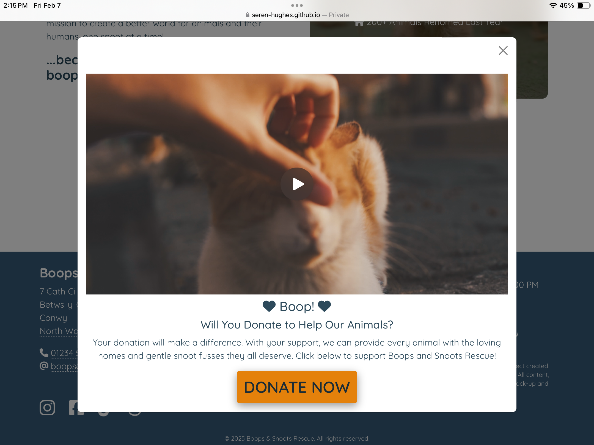

--- 

