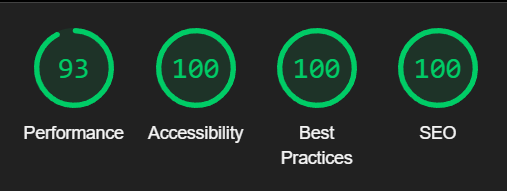

# BOOPS & SNOOTS RESCUE - TESTING

## Table Of Contents:

1. [Google Lighthouse Performance](#google-lighthouse-results)
2. [Responsiveness](#responsiveness)
3. [Code Validation](#code-validation)
4. [Manual Testing](#manual-testing)
   - [User Stories](#user-stories)
   - [Testing and Browser Compatibility](#testing-and-browser-compatibility)
5. [Bugs](#bugs)
6. [Feedback](#feedback)

## Google Lighthouse Results

### Index Page:


### Adopt Info Page:


### Donate Page:


### Contact Page


### Form Confirmation Page


### 404 Error Page


### Google Lighthouse Results On Mobile

<details><Summary>Index Page</summary>


</details>

<details><Summary>Adopt Page</summary>


</details>

<details><Summary>Donate Page</summary>


</details>

<details><Summary>Contact Page</summary>



</details>

<details><Summary>Form Confirmation Page</summary>


</details>

<details><Summary>404 Page</summary>


</details>

### Responsiveness

The website was tested during development for responsiveness using Google Developer Tools to ensure it adapts to different screen sizes. The layout was checked across various devices, including mobile, tablet, and laptop views. All elements, including text, images, and navigation, adjusted correctly to different screen resolutions without overlapping or breaking. Below are some screenshots demonstrating the site's appearance on mobile, tablet, and laptop screens.

<details><summary>Home page on iPhone (Safari)</summary>


</details>

<details><summary>Contact form page on iPhone (Safari)</summary>


</details>

<details><summary>Confirmation page on iPhone (Safari)</summary>


</details>

<details><summary>Footer on iPhone (Chrome)</summary>


</details>

<details><summary>Contact page on iPad</summary>


</details>

<details><summary>Donate Page on iPad</summary>


</details>

<details><summary>404 Page on iPad</summary>


</details>

<details><summary>Adopt page on laptop</summary>


</details>

---

## **Code Validation**

### HTML W3C Validation

- **Index Page:** [Document checking completed. No errors or warnings to show.](https://validator.w3.org/nu/?doc=https%3A%2F%2Fseren-hughes.github.io%2Fboops-and-snoots-rescue%2Findex.html)

- **Adopt Page:** [Document checking completed. No errors or warnings to show.](https://validator.w3.org/nu/?showsource=yes&useragent=Validator.nu%2FLV+https%3A%2F%2Fvalidator.w3.org%2Fservices&acceptlanguage=&doc=https%3A%2F%2Fseren-hughes.github.io%2Fboops-and-snoots-rescue%2Fadopt-info.html)

- **Donate Page:** [Document checking completed. No errors or warnings to show.](https://validator.w3.org/nu/?doc=https%3A%2F%2Fseren-hughes.github.io%2Fboops-and-snoots-rescue%2Fdonations.html)

- **Contact Page:** [Document checking completed. No errors or warnings to show.](https://validator.w3.org/nu/?doc=https%3A%2F%2Fseren-hughes.github.io%2Fboops-and-snoots-rescue%2Fcontact.html)

- **Form Confirmation Page:** [Document checking completed. No errors or warnings to show.](https://validator.w3.org/nu/?doc=https%3A%2F%2Fseren-hughes.github.io%2Fboops-and-snoots-rescue%2Fform-confirmation.html)

- **404 Page:** [Document checking completed. No errors or warnings to show.](https://validator.w3.org/nu/?doc=https%3A%2F%2Fseren-hughes.github.io%2Fboops-and-snoots-rescue%2F404.html)

### CSS W3C Validation


### JSHint
- **JSHint JavaScript Validating** 


## **Manual Testing**

### User Stories:

### Home Page User Story:

> "As someone visiting the website, I want to easily understand what the organisation is about, find information about available animals, learn about the adoption process (including fees), how to get involved or donate, and quickly access contact details, location, and opening hours so I can plan my visit or make enquiries."

#### Test Cases:

| **Goal**                                                                    | **How is it achieved?**                                                                                                 | **Passed** |
| --------------------------------------------------------------------------- | ----------------------------------------------------------------------------------------------------------------------- | ---------- |
| **Clear Organisation Purpose**                                              |                                                                                                                         |            |
| The homepage clearly states the purpose of the organisation.                | The user sees a hero section with a welcoming message and an introduction to Boops & Snoots Rescue.                     | ✅         |
| **Easy Navigation**                                                         |                                                                                                                         |            |
| Navigation links to key sections (Adoption, Donations, Contact).            | The navigation bar is visible at the top and provides easy access to relevant pages.                                    | ✅         |
| **Adoption & Animal Information**                                           |                                                                                                                         |            |
| Information about available animals and the adoption process is accessible. | The homepage links to an adoption section where users can learn about adoption requirements and fees.                   | ✅         |
| **Donation Options**                                                        |                                                                                                                         |            |
| Donation options are clearly explained.                                     | The homepage features a call to action button and modal, which take users to the donate page with all relevant details. | ✅         |
| **Contact & Location Information**                                          |                                                                                                                         |            |
| Contact details, location, and opening hours are easily found.              | The footer contains the organisation's contact information, opening hours, and address.                                 | ✅         |

#### Screenshots:

<details><summary>Navigation to key sections including adoption. Click to see screenshots</summary>


</details>

<details><summary>Purpose of the organisation. Donation link. Click to see screenshots</summary>


</details>

<details><summary>Contact details, location, and opening hours. Click to see screenshots</summary>


</details>

---

### Donations User Stories

#### User Stories:

> "As a pet owner, I want to donate items like unused pet food to help the shelter and avoid waste."

> "As a visitor to the site, I want to know what items the shelter needs so I can contribute effectively."

> "As someone who wants to support the organisation financially, I want clear information on how to donate money, so I can contribute easily and confidently."

#### Test Cases:

| **Goal**                                                     | **How is it achieved?**                                                                                                                    | **Passed** |
| ------------------------------------------------------------ | ------------------------------------------------------------------------------------------------------------------------------------------ | ---------- |
| **Physical Donations**                                       |                                                                                                                                            |            |
| Users can find out what items the shelter needs.             | The donations page lists accepted physical donations like food, bedding, and toys.                                                         | ✅         |
| Users know how and where to drop off physical donations.     | Clear instructions are provided on when and where to bring donations (e.g., opening hours and location details).                           | ✅         |
| **Monetary Donations**                                       |                                                                                                                                            |            |
| Users can easily find information on how to donate money.    | The donations page includes links to PayPal and JustGiving with clear donation instructions.                                               | ✅         |
| **Encouraging Support**                                      |                                                                                                                                            |            |
| The website provides a call-to-action encouraging donations. | A donate link is featured in the navigation bar and donate button is prominently on the home page including the modal encouraging support. | ✅         |

#### Screenshots:

<details><summary>Monetary and item list donations. Click to see screenshots</summary>


</details>

<details><summary>Encouraging support calls to action. Click to see screenshots</summary>


</details>

---

### Adoptions User Stories

#### User Stories:

> "As someone looking to adopt, I want to find out how I can find a pet, understand the adoption process (including costs and requirements), and easily find contact information to speak to someone about adoptions or ask questions."

> "As someone adopting a pet, I want to know where the shelter is located and its opening hours so I can plan my visit."  
> "As someone adopting a pet, I want to feel confident that the animal I adopt has been assessed for health and behaviour, ensuring it is ready for a safe and happy transition into my home—especially if I have children."

> "As someone looking to adopt or foster an animal, I want an online application form so that I can easily provide my details and speed up the process of being matched with a suitable pet."

#### Test Cases:

| **Goal**                                          | **How is it achieved?**                                                                                                                                          | **Passed** |
| ------------------------------------------------- | ---------------------------------------------------------------------------------------------------------------------------------------------------------------- | ---------- |
| **Finding Adoption Information**                  |                                                                                                                                                                  |            |
| Users can easily access adoption information.     | The adoption page provides details on how to find adoptable pets via Facebook and Instagram or by contacting the shelter.                                        | ✅         |
| Users can contact the shelter with questions.     | Contact details are available on all pages in the footer. The adoption page includes an on-page text link directing users to the footer for contact information. | ✅         |
| **Planning a Visit**                              |                                                                                                                                                                  |            |
| Users can find the shelter’s location and hours.  | The contact page and footer include the full address, opening hours, phone number and email.                                                                     | ✅         |
| **Confidence in Adoption Process**                |                                                                                                                                                                  |            |
| Users are assured about pet health and behaviour. | The adoption page explains that pets receive vet checks, vaccinations, and behaviour assessments before adoption.                                                | ✅         |
| **Adoption Application**                          |                                                                                                                                                                  |            |
| Users can submit an online application.           | An adoption form is available on the adoption page to collect essential details, speeding up the interview process.                                              | ✅         |

#### Screenshots:

<details><summary>Adopting information. Click to see screenshots</summary>


</details>

<details><summary>Confidence and trust in shelters adoption process. Click to see screenshots</summary>


</details>

<details><summary>Adopt application form. Click to see screenshots</summary>


</details>

---

### Contact User Stories:

> "As a visitor to the website, I want to easily find contact information so that I can quickly get in touch with the organisation for general inquiries."

> "As someone wanting to ask a question, I want a simple enquiry form so I can send a message without needing to email directly."

> "As a potential visitor, I want to know the organisation’s location, phone number, and opening hours so I can plan my visit."
> "As a social media user, I want links to the organisation’s social accounts so I can follow updates and message them through my preferred platform."

> "As a user visiting the website, I want a disclaimer that explains the website is fictional so I understand its purpose and context."

#### Test Cases:

| **Goal**                                        | **How is it achieved?**                                                                                        | **Passed** |
| ----------------------------------------------- | -------------------------------------------------------------------------------------------------------------- | ---------- |
| **Finding Contact Information**                 |                                                                                                                |            |
| Easily locate general contact details.          | The footer contains the organisation's contact email and phone number.                                         | ✅         |
| **Enquiry Form**                                |                                                                                                                |            |
| A simple form for users to send enquiries.      | The contact page includes an easy-to-use enquiry form with fields for name, email, and message.                | ✅         |
| **Location & Opening Hours**                    |                                                                                                                |            |
| Access address, phone number, and hours.        | The footer and contact page display the location, phone number, and opening hours.                             | ✅         |
| **Social Media Links**                          |                                                                                                                |            |
| Easily follow the organisation on social media. | The footer and contact page provide links to Facebook, Instagram, TikTok, and Threads.                         | ✅         |
| **Fictional Website Disclaimer**                |                                                                                                                |            |
| Users understand the website is fictional.      | A disclaimer is placed in the footer, stating that the website is for educational and portfolio purposes only. | ✅         |

#### Screenshots:

<details><summary>Contact form. Click to see screenshot</summary>


</details>

---

## **Testing and Browser Compatibility**

The website was tested on multiple browsers and devices to ensure compatibility and responsiveness.

#### **Browsers Tested:**

- Google Chrome
- Microsoft Edge
- Firefox
- Safari

#### **Devices Tested:**

- Laptop
- iPhone X
- iPad

#### **Manual Testing Results**

| **Feature Tested**                           | **Expected Outcome**                                                  | **Test Result** |
| -------------------------------------------- | --------------------------------------------------------------------- | --------------- |
| Navigation Links                             | All links direct to correct pages                                     | ✅ Passed       |
| On-Page Text Links (e.g. Location in Footer) | Links navigate smoothly to the correct section                        | ✅ Passed       |
| Forms                                        | Forms can be filled out and submitted                                 | ✅ Passed       |
| Form Confirmation Page                       | Dummy confirmation page appears after valid submission                | ✅ Passed       |
| Buttons                                      | Buttons respond and perform actions                                   | ✅ Passed       |
| External Links                               | Links open in a new tab as expected                                   | ✅ Passed       |
| Mobile Responsiveness                        | Layout adapts properly on all devices                                 | ✅ Passed       |
| Bootstrap Modal with Video                   | Video opens in modal on image click; does not autoplay                | ✅ Passed       |
| Custom Pointer on Nose Image Link            | Custom pointer effect works on different browsers                     | ✅ Passed       |
| 404 Page                                     | 404.html on GitHub pages appears when a wrong address or typo is used | ✅ Passed       |

All tests were successfully completed, ensuring a smooth user experience across different platforms.

---

# Bugs

🐞 **Home | Index Page** 🐛

Accessibility & Usability Improvements

- **Issue:** Used `width="100%"` directly on the video element. The validator flagged this as an invalid attribute value.
- **Fix:** Moved the `width: 100%` styling to CSS instead of using an inline attribute.
- **Result:** Ensured proper styling while maintaining valid HTML.

---

- **Issue:** `aria-labelledby` attribute was used incorrectly without referencing an existing ID.
- **Fix:** Replaced `aria-labelledby` with `aria-label="Donate Now"` where needed.
- **Result:** Improved screen reader accessibility by providing a clear label for interactive elements.

---

- **Issue:** `<a>` elements had an invalid `type="button"` attribute.
- **Fix:** Removed `type="button"` from `<a>` elements and kept `role="button"` where appropriate.
- **Result:** Ensured valid HTML while maintaining accessible button-like behaviour for links.

---

- **Issue:** Missing `role="button"` on modal-triggering links.
- **Fix:** Added `role="button"` to `<a>` elements that function as buttons, such as those opening modals.
- **Result:** Enhanced keyboard navigation and screen reader compatibility.

---

- **Issue:** Unclosed `<div>` tags, which could cause layout issues and unexpected behaviour.
- **Fix:** Identified and properly closed all `<div>` tags.
- **Result:** Improved structural integrity of the HTML, preventing rendering errors.

---

🐞 **Adopt Page** 🐛

Incorrectly nested and unclosed div and section elements

- **Issue:** W3C HTML Validator flagged errors due to unclosed div and section tags, and the use of section elements where no heading was needed.
- **Fix:** Closed all open tags correctly and replaced unnecessary `<section>` elements with `<div>` to ensure proper document structure.
- **Result:** The page now passes W3C validation without errors.

Accessibility & Usability Improvements:

- **Issue:** Missing `autocomplete` attributes in forms. Lighthouse flagged the absence of autocomplete attributes on some form fields, which can improve user experience by enabling browser suggestions.
- **Fix:** Added appropriate autocomplete values (e.g., "name", "email", "address") to form fields.
- **Result:** Improved form usability and accessibility.

Improved screen reader compatibility for forms

- **Issue:** Lighthouse flagged accessibility concerns related to form structure, specifically missing context for screen readers.
- **Fix:** Added `<fieldset>` and `<legend>` elements to group related form fields logically.
  Used CSS (from 'Inclusively Hidden' by Scott O'Hara) to visually hide a legend while keeping it accessible to screen readers.
- **Result:** The form is now better structured for assistive technologies without altering the visual layout.

---

🐞 **Donate Page** 🐛

Accessibility & Usability Improvements

- **Issue:** Incorrect image path format (\ instead of /) flagged by W3C HTML Validator.
- **Fix:** Updated all image paths to use forward slashes (/) for proper cross-platform compatibility.
- **Result:** Ensured images load correctly across different operating systems and browsers.

---

- **Issue:** Duplicate id attributes on `donate-image` and `donate-sub-heading`.
- **Fix:** Changed the duplicate IDs to classes and updated the corresponding styles in style.css.
- **Result:** Ensured valid HTML and improved maintainability by following best practices for class-based styling.

---

🐞 **Contact Page** 🐛

Accessibility & Usability Improvements

- **Issue:** Incorrect image path format (\ instead of /).
- **Fix:** Updated all image paths to use forward slashes (/) for proper cross-platform compatibility.
- **Result:** Ensured images load correctly across different operating systems and browsers.

---

- **Issue:** Unclosed div tags flagged by W3C HTML Validator, which could cause structural and layout issues.
- **Fix:** Identified and properly closed all div tags to ensure correct nesting.
- **Result:** Improved HTML validity and prevented potential rendering issues.

---

🐞 **Form Confirmation Page** 🐛

Accessibility & Usability Improvements

- **Issue:** Unclosed div tags, which could cause structural and layout issues.
- **Fix:** Identified and properly closed all div tags to ensure correct nesting.
- **Result:** Improved HTML validity and prevented potential rendering issues.

---

- **Issue:** `<section>` elements were used where no heading was present, which was flagged by the validator.
- **Fix:** Replaced unnecessary section elements with `<div>` elements where a heading wasn’t needed.
- **Result:** Improved semantic HTML structure and ensured proper use of landmark elements.

---

- **Issue:** `type="button"` attribute incorrectly used on `<a>` elements.
- **Fix:** Removed `type="button"` and instead used `role="button"` to indicate button-like behavior.
- **Result:** Ensured valid HTML while maintaining accessibility for interactive elements.

---

- **Issue:** `aria-labelledby` was used incorrectly without referencing an existing ID.
- **Fix:** Replaced `aria-labelledby` with `aria-label` to provide a clear, standalone label for assistive technologies.
- **Result:** Improved screen reader accessibility by ensuring elements have proper labeling.

---

🐞 **404 Error Page** 🐛

Accessibility & Usability Improvements

- **Issue:** Inline width styling on the cat image.
- **Fix:** Removed the inline width attribute and added a new class `.bad-cat`. Updated style.css to define width and adjusted media queries accordingly.
- **Result:** Ensured a cleaner separation of structure and styling, improving maintainability and responsiveness.

---

- **Issue:** `<section>` elements were used where no heading was present were flagged by the validator.
- **Fix:** Replaced unnecessary section elements with `<div>` elements where a heading wasn’t needed.
- **Result:** Improved semantic HTML structure and ensured correct use of landmark elements.

---

- **Issue:** `type="button"` incorrectly used on `<a>` elements.
- **Fix:** Removed `type="button"` and used `role="button"` to indicate button-like behaviour.
- **Result:** Maintained accessibility for interactive elements while ensuring valid markup.

---

- **Issue:** `aria-labelledby` used without referencing an existing ID.
- **Fix:** Replaced `aria-labelledby` with `aria-label` to provide a clear, standalone label for screen readers.
- **Result:** Improved accessibility and ensured proper labeling of elements.

---

- **Issue:** Unclosed div tags, which could affect layout and rendering.
- **Fix:** Identified and properly closed all div tags.
- **Result:** Improved HTML validity and structural integrity.

---

- **Issue:** Missing `alt` attribute on the 404 error page image.
- **Fix:** Added a descriptive alt attribute to the image to ensure accessibility for screen readers.
- **Result:** Improved accessibility by making the image understandable for visually impaired users.

---

🐞 Video Thumbnail on Mobile Devices 🐛

- **Issue:** The video modal did not display a thumbnail on iPhone (Safari/Chrome). The video should show a preview image before playback.
- **Fix:** Added the `poster` attribute to the video element to specify a preview image.
- **Result:** The thumbnail now appears correctly on all devices.

<details><summary>Issue Screenshot</summary>


</details>

<details><summary>Fix on Chrome iPhone</summary>


</details>

<details><summary>Fix on Safari iPhone</summary>


</details>

<details><summary>Fix on Safari iPad</summary>


</details>

---

🐞 Touch Target Spacing on Contact Links 🐛

- **Issue:** Google Lighthouse flagged the phone number and email links in the footer as too close together on mobile, making them difficult for some users to tap.
- **Fix:** Increased spacing between links using `margin-bottom` to prevent shifting the dashed underline. Applied changes only in media queries for smaller screens.
- **Result:** Improved mobile accessibility and passed Lighthouse's touch target spacing test while maintaining visual styling.


🐞 Footer Heading Order Accessibility Fix 🐛

- **Issue:** Google Lighthouse flagged footer headings on the 404 page and form confirmation page for not being in sequentially descending order, affecting accessibility.
- **Fix:** Updated the HTML structure to follow correct heading hierarchy. This change initially affected styling, so I applied `class="h4"` inline to maintain consistent footer styles across all pages.
- **Result:** Improved accessibility by ensuring proper heading structure while preserving the original visual styling.


🐞 Footer Small Text Legibility Fix (Mobile Devices Best Practices) 🐛

- **Issue:** Google Lighthouse flagged the 404 page and form confirmation page for having small, hard-to-read text in the footer (disclaimer, copyright, and brand text). This was due to the percentage of text under 12px being too high on mobile.
- **Fix:** Added a media query for small screens (max-width: 480px) to ensure that footer and text elements are legible. This adjustment only applies on mobile to maintain consistency with the existing design.
- **Result:** Improved Best Practices score to 100 on mobile while preserving the original footer styling on larger screens.

🐞 Phone Number Input Accepting Letters 🐛

- **Issue:** A fellow student kindly conducted manual testing of the form and discovered that the phone number input field `type="tel"` allowed letters to be entered and submitted.
- **Cause:** The `type="tel"` attribute does not automatically enforce numeric input; it provides the appropriate keyboard on mobile devices.
- **Fix:** I chose not to use `type="number"`. type="number" removes leading zeros.
  - It also allows up/down arrows, which are unnecessary for entering a phone number.
  - Screen readers may interpret it as a mathematical value rather than a phone number.
  - Instead, I kept `type="tel"` for better accessibility and added validation:

Pattern validation: Restricts input to numbers, spaces, +, -, and (). The maximum length is set to 15 characters."

```
<input type="tel" class="form-control" id="inputPhoneNumber" name="phone" pattern="[0-9\s\-\(\)\+]+" maxlength="15" required>
```

JavaScript validation: Prevents invalid characters

```
<script>
    document.getElementById("inputPhoneNumber").addEventListener("input", function (e) {
      this.value = this.value.replace(/[^0-9+\s-()]/g, "");
    });
  </script>
```

**Credit:** The input validation solution was inspired by discussions on [Stack Overflow](https://stackoverflow.com/questions/8936018/limit-input-to-numbers-and-on-input-field) and guidance from [MDN Web Docs](https://developer.mozilla.org/en-US/docs/Web/HTML/Element/input/tel#validation). Additionally, an insightful discussion on type="tel" and its behaviour with assistive technologies was found in [this Stack Overflow answer.](https://stackoverflow.com/questions/67903970/how-do-i-accept-only-numbers-and-reject-letters-for-input-tel)

🐞 Moving Inline JavaScript to an External Script File 🐛

- **Issue:** Initially, I placed my JavaScript directly at the bottom of my adopt.html page. While this worked, my mentor, Daniel Hamilton, pointed out that it’s best practice to keep JavaScript separate for better maintainability, reusability, and readability.
- **Fix:** I created a js folder inside the assets directory and moved my script into assets/js/script.js. I then linked this file in my adopt.html and contact.html using: 
`<script src="assets/js/script.js"></script>`
- **Result:** This approach keeps my HTML cleaner and allows me to manage my scripts more efficiently.

**Credit** Thanks to my mentor, Daniel Hamilton, for the guidance on structuring my project properly.

**Note:** While most of my JavaScript is in a separate script.js file (e.g., for form validation), I chose to keep my Bootstrap modal script inline in the index HTML. This follows Bootstrap’s standard implementation and ensures smooth functionality without additional complexity. The modal performed as expected in all tests, opening and closing correctly without errors. 

🐞 Uncaught TypeError: Cannot Read Properties of Null (Reading 'addEventListener') 🐛

- **Issue:** While testing in Google Developer Tools, I encountered an error:


- **Cause:** This happened because my JavaScript was trying to attach an event listener to an element before it existed in the DOM.
- **Fix:** I wrapped my script inside a `DOMContentLoaded` event to ensure it runs only after the page has fully loaded.
Even though my script was already placed before `</body>`, this extra safeguard ensured there were no timing issues.

**Credit:** The explanation that helped me understand this issue came from [Codedamn](https://codedamn.com/news/javascript/fixing-cannot-read-property-addeventlistener-of-null-error-in-javascript), which clearly outlined why this error occurs and how `DOMContentLoaded` resolves it.

## Feedback

I have thoroughly tested this project to ensure functionality, usability, and responsiveness. However, I welcome any feedback or suggestions for improvement. If you spot any issues or have ideas on how this project could be enhanced, please feel free to reach out.
